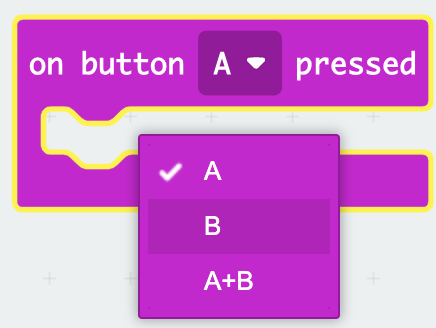

## Use the buttons to skip tunes

Instead of changing the melody by changing the `tune` variable value in the `on start` block, you can use buttons to change the value (and, therefore, the melody).

In this step, you will create code to skip tracks using the micro:bit's event handlers.

<p style="border-left: solid; border-width:10px; border-color: #0faeb0; background-color: aliceblue; padding: 10px;">
What is an <span style="color: #0faeb0">event handler</span>?

An event handler is code that will run when a particular event happens, such as “button A pressed”.

</p>

### Add button controls

The micro:bit has a Button `A` and a Button `B`.

You can use an event to control what happens when a button is pressed.

### Skip to the next track

Button B is on the right of the micro:bit, so use this button to skip to the next track.

To do this, you need to change the value of the `tune`{:class="microbitvariables"} variable by `1`.

--- task ---

From the `Input`{:class="microbitinput"} menu, drag the `on button`{:class="microbitinput"} block to the code editor panel.


--- /task ---

--- task ---

Click on the arrow next to `A`{:class="microbitinput"} on the `on button`{:class="microbitinput"} block.

Change the `A`{:class="microbitinput"} to a `B`{:class="microbitinput"}



--- /task ---

#### Stop all sounds!

Now, you need to stop the current tune.

--- task ---

From the `Music`{:class="microbitmusic"} menu, drag the `stop all sounds`{:class="microbitmusic"} block.

Place it in the `on button [B]`{:class="microbitinput"} block in the code editor panel.


```microbit
input.onButtonPressed(Button.B, function () {
    music.stopAllSounds()
})
```

--- /task ---

--- task ---

From the `Variables`{:class="microbitvariables"} menu, drag the `change`{:class="microbitvariables"} block.

Place it below the `stop all sounds`{:class="microbitmusic"} block.


```microbit
let tune = 0
input.onButtonPressed(Button.B, function () {
    music.stopAllSounds()
    tune += 1
})
```

--- /task ---

#### Dealing with 'out of range'

If the value of the variable is `4`, then changing it by `1` will make the value `5`.

🚨 But there is no melody associated with the value `5`! 🚨

Because you only have four melodies, if the variable changes to 5, you need to go back to the first melody.

```microbit
basic.forever(function () {
    let tune = 0
    if (tune == 1) {
        basic.showIcon(IconNames.Duck)
        music._playDefaultBackground(music.builtInPlayableMelody(Melodies.Dadadadum), music.PlaybackMode.UntilDone)
    } else if (tune == 2) {
        basic.showIcon(IconNames.Silly)
        music._playDefaultBackground(music.builtInPlayableMelody(Melodies.Punchline), music.PlaybackMode.UntilDone)
    } else if (tune == 3) {
        basic.showLeds(`
            . # . # .
            . # . # .
            # # # # #
            # # # # #
            # # # # #
            `)
        music._playDefaultBackground(music.builtInPlayableMelody(Melodies.Birthday), music.PlaybackMode.UntilDone)
    } else if (tune == 4) {
        basic.showIcon(IconNames.Skull)
        music._playDefaultBackground(music.builtInPlayableMelody(Melodies.Baddy), music.PlaybackMode.UntilDone)
    }
})
```

--- task ---

From the `Logic`{:class="microbitlogic"} menu, drag the `if`{:class="microbitlogic"} block.

Place it below the `change tune`{:class="microbitvariables"} block in your code.

```microbit
let tune = 0
input.onButtonPressed(Button.B, function () {
    music.stopAllSounds()
    tune += 1
    if (true) {

    }
})
```

--- /task ---

--- task ---

Also from the `Logic`{:class="microbitlogic"} menu, drag a `0 < 0`{:class="microbitlogic"} block.

Place it inside the `true` part of the `if`{:class="microbitlogic"} block.

Change the `<` (less than) to `>` (greater than) by clicking on the arrow next to the `<` symbol.

```microbit
let tune = 0
input.onButtonPressed(Button.B, function () {
    music.stopAllSounds()
    tune += 1
    if (0 > 0) {

    }
})
```

--- /task ---

--- task ---

From the `Variables`{:class="microbitvariables"} menu, drag the `tune`{:class="microbitvariables"} variable  block.

Place it on the first `0` in the `0 > 0`{:class="microbitlogic"} block.

```microbit
let tune = 0
input.onButtonPressed(Button.B, function () {
    music.stopAllSounds()
    tune += 1
    if (tune > 0) {

    }
})
```

Change the second `0` to `4`.

```microbit
let tune = 0
input.onButtonPressed(Button.B, function () {
    music.stopAllSounds()
    tune += 1
    if (tune > 4) {

    }
})
```

--- /task ---

--- task ---

From the `Variables`{:class="microbitvariables"} menu, drag the `set`{:class="microbitvariables"} block.

Place it inside the `if`{:class="microbitlogic"} block in your code.

Change the `0` to `1`.

```microbit
let tune = 0
input.onButtonPressed(Button.B, function () {
    music.stopAllSounds()
    tune += 1
    if (tune > 4) {
        tune = 1
    }
})
```

--- /task ---


#### Skip to the previous track

Button A is on the left of the micro:bit, so use this button to skip to the previous track.

To do this, you need to change the value of the `tune`{:class="microbitvariables"} variable by `-1`.

You can re-use the code you created to control what happens when Button B is pressed.

--- task ---

**Right-click** on the top part of the `on button B pressed`{:class="microbitinput"} block that you now have in the code editor panel.

Click **Duplicate** to make a copy of the whole block.

You should now have a second `on button`{:class="microbitinput"} block that will be 'greyed out'.

Change the button from `B` to `A`. This will stop the block from being greyed out.

```microbit
let tune = 0
input.onButtonPressed(Button.A, function () {
    music.stopAllSounds()
    tune += 1
    if (tune > 4) {
        tune = 1
    }
})
input.onButtonPressed(Button.B, function () {
    music.stopAllSounds()
    tune += 1
    if (tune > 4) {
        tune = 1
    }
})
```

--- /task ---

--- task --- Make these changes to the `on button A pressed`{:class="microbitinput"} block:

Change the `1` to `-1` in the `change`{:class="microbitvariables"} block.

In the comparison block:

+ Change the `<` to `>`

+ Change the `1` to `4`

Change the `1` to `4` in the `set`{:class="microbitvariables"} block.

--- /task ---


You should now have an `on button A pressed`{:class="microbitinput"} block of code and an `on button B pressed`{:class="microbitinput"} block of code:

```microbit
let tune = 0
input.onButtonPressed(Button.A, function () {
    music.stopAllSounds()
    tune += -1
    if (tune < 1) {
        tune = 4
    }
})
input.onButtonPressed(Button.B, function () {
    music.stopAllSounds()
    tune += 1
    if (tune > 4) {
        tune = 1
    }
})
```

--- task ---

**Debug:** Make sure you have changed the correct values in the blocks used to change the value of the variables.

For example: `Button A` should change the variable by `-1` and Button B should change the variable value by `1`.

--- /task ---

--- task ---

When you make a change to a code block in the code editor panel, the simulator will restart.

**Test your program**

+ Press Button A to skip to the previous track

+ Press Button B to skip to the next track

--- /task ---


Well done, you can now skip your tracks back and forth!
