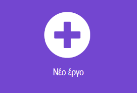
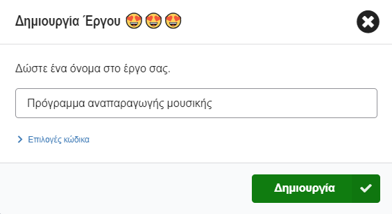
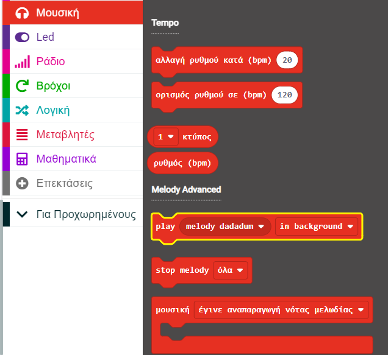
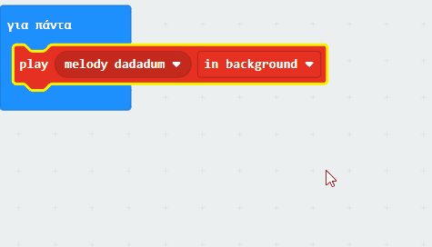
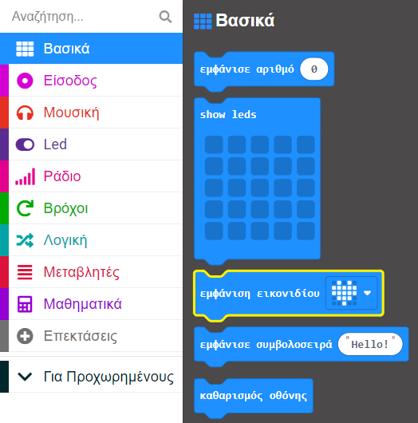
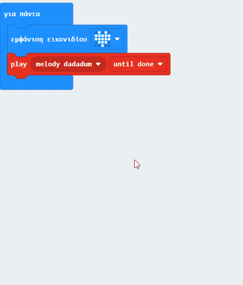

## Παίξε μια μελωδία

### Άνοιξε το MakeCode

Για να ξεκινήσεις τη δημιουργία του έργου σου με το micro:bit, πρέπει να ανοίξεις το πρόγραμμα επεξεργασίας MakeCode.

--- task ---

Άνοιξε το πρόγραμμα επεξεργασίας MakeCode στη διεύθυνση [makecode.microbit.org](https://makecode.microbit.org){:target="_blank"}.

--- collapse ---

---
title: Εκτός σύνδεσης έκδοση του επεξεργαστή
---

Υπάρχει επίσης μια έκδοση με [δυνατότητα λήψης του προγράμματος επεξεργασίας MakeCode](https://makecode.microbit.org/offline-app){:target="_blank"}.

--- /collapse ---

--- /task ---

### Πρώτο έργο micro:bit;

[[[makecode-tour]]]

### Δημιούργησε το έργο σου

Μόλις ανοίξει το πρόγραμμα επεξεργασίας, θα χρειαστεί να δημιουργήσεις ένα νέο έργο και να δώσεις ένα όνομα στο έργο σου.

--- task ---

Κάνε κλικ στο κουμπί **Νέο έργο**.



--- /task ---

--- task ---

Δώσε στο νέο σου έργο το όνομα `Πρόγραμμα αναπαραγωγής μουσικής` και κάνε κλικ στο **Δημιουργία**.



**Συμβουλή:** Για να γίνει πιο εύκολη η εύρεση του έργου σου αργότερα, δώσε του ένα όνομα που να σχετίζεται με τη δραστηριότητα που δημιουργείς.

--- /task ---

### Παίξε μελωδία


Θα χρησιμοποιήσεις το μπλοκ `για πάντα`{:class="microbitbasic"} για να χρησιμοποιήσεις την έξοδο ηχείου στο micro:bit (μόνο για χρήστες V2).

--- collapse ---
---
title: Χρήστες του micro:bit V1
---

Η έξοδος ηχείου είναι διαθέσιμη μόνο στο micro:bit V2. Θα χρειαστεί να συνδέσεις εξωτερικά ακουστικά/ηχεία για αναπαραγωγή ήχου στο V1. Θα είσαι ακόμα σε θέση να παίξεις τον ήχο στον προσομοιωτή.

Υπάρχει ένας οδηγός [για τη σύνδεση ακουστικών/ηχείων στο V1 micro:bit](https://makecode.microbit.org/projects/hack-your-headphones/make){:target="_blank"}.

--- /collapse ---


--- task ---

Από το μενού `Μουσική`{:class="microbitmusic"}, σύρε το μπλοκ `play melody dadadum`{:class="microbitmusic"} και τοποθέτησέ το μέσα στο μπλοκ `για πάντα`{:class="microbitbasic"}.



--- /task ---

--- task ---

Κάνε κλικ στο κάτω βέλος δίπλα στο `στο φόντο` στο μπλοκ `play melody dadadum`{:class='microbitmusic'}.

Επίλεξε `until done`.



--- /task ---

### Δώσε στυλ στο τραγούδι σου

Εκτός από την αναπαραγωγή μιας μελωδίας, μπορείς να προσθέσεις μια εικόνα στην οθόνη LED για να προσθέσεις λίγο περισσότερο στυλ!

--- task ---

Άνοιξε το μενού `Βασικά`{:class="microbitbasic"} και βρες το μπλοκ `εμφάνιση εικονιδίου`{:class="microbitbasic"}.



--- /task ---

--- task ---

Σύρε το μπλοκ `εμφάνιση εικονιδίου`{:class="microbitbasic"} στο πρόγραμμα επεξεργασίας κώδικα.

Τοποθέτησέ το μέσα στο `για πάντα`{:class="microbitbasic"} **πάνω από το** μπλοκ της `μελωδίας`{:class="microbitmusic"}.

--- /task ---

--- task ---

Το MakeCode έχει προ-προγραμματισμένα εικονίδια που εμφανίζονται στον πίνακα LED.

Η προεπιλογή είναι ένα εικονίδιο **καρδιά**.

**Κάνε κλικ** στην καρδιά για να δεις τις άλλες επιλογές.

**Επίλεξε** ένα εικονίδιο που αντιπροσωπεύει τη μελωδία σου.



Διαλέξαμε αυτό το παπάκι!

```microbit
basic.forever(function () {
    basic.showIcon(IconNames.Duck)
    music._playDefaultBackground(music.builtInPlayableMelody(Melodies.Dadadadum), music.PlaybackMode.UntilDone)
})
```

--- /task ---

--- task ---

Όταν κάνεις μια αλλαγή σε ένα μπλοκ στο πρόγραμμα επεξεργασίας κώδικα, ο προσομοιωτής θα επανεκκινήσει.

**Δοκίμασε το έργο σου**

+ Θα πρέπει τώρα να ακούσεις τη μελωδία να παίζει μέχρι να ολοκληρωθεί (και στη συνέχεια να ακούγεται λόγω του βρόχου για πάντα)
+ Θα πρέπει επίσης να δεις το εικονίδιο που επέλεξες να εμφανίζεται στα LED

--- /task ---    

Μπράβο, δημιουργήσες το πρώτο σου μουσικό πρόγραμμα σε micro:bit!
