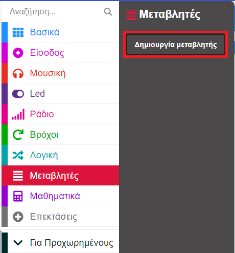
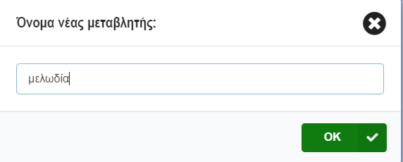
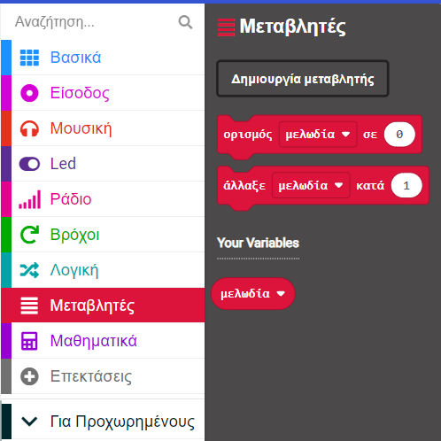
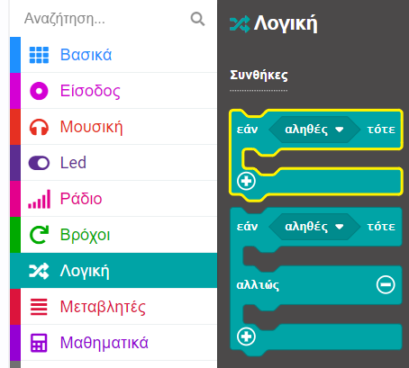
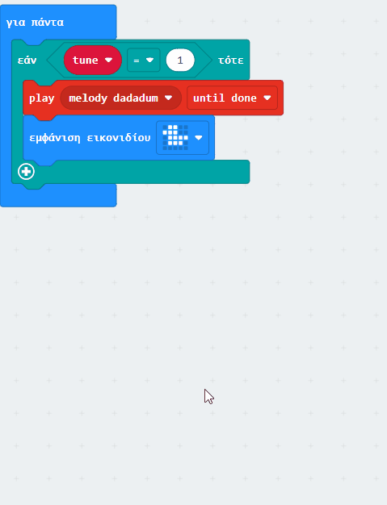
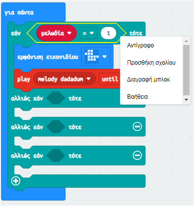
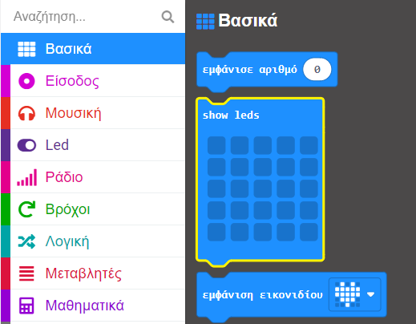
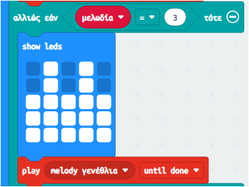

## Επιτρέποντας επιλογές

### Δημιούργησε μία μεταβλητή

Σε όλη τη διαδικασία δημιουργίας του προγράμματος σου αναπαραγωγής μουσικής, θα πρέπει να χρησιμοποιήσεις μεταβλητές.

<p style="border-left: solid; border-width:10px; border-color: #0faeb0; background-color: aliceblue; padding: 10px;">
Τι είναι μια <span style="color: #0faeb0">μεταβλητή;</span>

Μια μεταβλητή είναι ένας τρόπος επισήμανσης και αποθήκευσης δεδομένων στα προγράμματά σου. Το πρόγραμμά σου μπορεί να χρησιμοποιήσει και να αλλάξει τα δεδομένα που είναι αποθηκευμένα σε μια μεταβλητή όταν εκτελείται.

Τα δεδομένα που είναι αποθηκευμένα σε μια μεταβλητή μπορεί να είναι ένας αριθμός όπως "10" ή μια λέξη όπως "δεινόσαυρος".</p>

--- task ---

Άνοιξε το μενού `Μεταβλητές`{:class="microbitvariables"} και κάνε κλικ στο κουμπί **Δημιουργία μεταβλητής**.



--- /task ---

--- task ---

Ονόμασε τη νέα μεταβλητή `μελωδία`{:class="microbitvariables"} και, στη συνέχεια, κάνε κλικ στο κουμπί **OK**.



--- /task ---

Θα υπάρχουν πλέον διαθέσιμα νέα μπλοκ που μπορείς να χρησιμοποιήσεις για να ορίσεις, να αλλάξεις ή να χρησιμοποιήσεις την τιμή που είναι αποθηκευμένη στη μεταβλητή `μελωδία`{:class="microbitvariables"}.



--- task ---

Σύρε το μπλοκ `ορισμός`{:class="microbitvariables"} και τοποθέτησέ το μέσα στο μπλοκ `κατά την έναρξη`{:class="microbitbasic"}.

Άλλαξε το `0` σε `1`.

```microbit
let μελωδία = 1
```

--- /task ---

### Χρήση του εάν... τότε

Για να μπορεί το πρόγραμμα αναπαραγωγής μουσικής να παίζει διαφορετικές επιλογές μελωδίας, θα χρειαστεί να χρησιμοποιήσεις ένα μπλοκ λογικής για κάθε μελωδία.

--- task ---

Από το μενού `Λογική`{:class="microbitlogic"} επίλεξε το μπλοκ `εάν`{:class="microbitlogic"}.



--- /task ---

--- task ---

Τοποθέτησε το μπλοκ `εάν`{:class="microbitlogic"} πάνω από το μπλοκ `εμφάνιση εικονιδίου`{:class="microbitbasic"}.

Κάνε κλικ στο μενού `Λογική`{:class="microbitlogic"} και σύρε ένα μπλοκ σύγκρισης `0 = 0`{:class="microbitlogic"}.

Τοποθέτησε το στην περιοχή `αληθές`{:class="microbitlogic"} του μπλοκ `εάν`{:class="microbitlogic"}.

```microbit
basic.forever(function () {
    if (0 == 0) {

    }
    basic.showIcon(IconNames.Duck)
    music._playDefaultBackground(music.builtInPlayableMelody(Melodies.Dadadadum), music.PlaybackMode.UntilDone)
})
```

--- /task ---

--- task ---

Από το μενού `Μεταβλητές`{:class="microbitvariables"}, σύρε ένα μπλοκ `μελωδία`{:class="microbitvariables"}.

Τοποθέτησέ το στο πρώτο `0` στο μπλοκ `0 = 0`{:class="microbitlogic"}.

Άλλαξε το δεύτερο `0` σε `1`.

```microbit
basic.forever(function () {
    let μελωδία = 0
    if (μελωδία == 1) {

    }
    basic.showIcon(IconNames.Duck)
    music._playDefaultBackground(music.builtInPlayableMelody(Melodies.Dadadadum), music.PlaybackMode.UntilDone)
})
```

--- /task ---

--- task ---

Μετακίνησε το εικονίδιο `εμφάνιση εικονιδίου`{:class="microbitbasic"} και `play melody`{:class="microbitmusic"} μέσα στο μπλοκ `εάν`{:class="microbitlogic"}.

**Συμβουλή:** Κάθε φορά που πιάνεις ένα μπλοκ, όλα τα μπλοκ κάτω από αυτό θα μετακινούνται επίσης, επομένως απλώς σύρε το μπλοκ `εμφάνιση εικονιδίου`{:class="microbitbasic"} και τα άλλα θα ακολουθήσουν.

```microbit
basic.forever(function () {
    let μελωδία = 0
    if (μελωδία == 1) {
        basic.showIcon(IconNames.Duck)
        music._playDefaultBackground(music.builtInPlayableMelody(Melodies.Dadadadum), music.PlaybackMode.UntilDone)
    }
})
```

--- /task ---

Για να προσθέσεις περισσότερες επιλογές μελωδίας, πρέπει να δημιουργήσεις περισσότερες συνθήκες στο μπλοκ `εάν`{:class="microbitlogic"}.

--- task ---

Κάνε κλικ στο σύμβολο `+` κάτω αριστερά από το μπλοκ `εάν`{:class='microbitlogic'}. Αυτό θα δημιουργήσει μια ενότητα `αλλιώς`{:class='microbitlogic'}.

--- /task ---

--- task ---

Κάνε κλικ στο σύμβολο `+` κάτω από την ενότητα `αλλιώς`{:class='microbitlogic'}.

Αυτό θα δημιουργήσει μια ενότητα `αλλιώς έαν`{:class='microbitlogic'}.

Επανάλαβέ το δύο φορές, ώστε να έχεις τρεις ενότητες `αλλιώς εάν`{:class="microbitlogic"} και μια ενότητα `αλλιώς`{:class="microbitlogic"}.

--- /task ---

--- task ---

Κάνε κλικ στο σύμβολο `-` δίπλα στην ενότητα `αλλιώς`{:class="microbitlogic"} για να καταργήσεις την ενότητα `αλλιώς`{:class="microbitlogic"}.



--- /task ---

--- task ---

Κάνε δεξί κλικ στο μπλοκ `μελωδία`{:class="microbitvariables"} `=`{:class="microbitlogic"} `1` και αντίγραψέ το.



--- /task ---

--- task ---

Τοποθέτησε το διπλότυπο μπλοκ `μελωδία`{:class="microbitvariables"} `=`{:class="microbitlogic"} `1` μεταξύ των πρώτων `αλλιώς εάν`{:class="microbitlogic"} και `τότε`{:class="microbitlogic"}.

Αντίγραψε δύο ακόμη μπλοκ σύγκρισης και τοποθετησέ τα μεταξύ των άλλων ενοτήτων `αλλιώς εάν`{:class="microbitlogic"} και `τότε`{:class="microbitlogic"}.

```microbit
basic.forever(function () {
    let μελωδία = 0
    if (μελωδία == 1) {
        basic.showIcon(IconNames.Duck)
        music._playDefaultBackground(music.builtInPlayableMelody(Melodies.Dadadadum), music.PlaybackMode.UntilDone)
    } else if (μελωδία == 1) {

    } else if (μελωδία == 1) {

    } else if (μελωδία == 1) {

    }
})
```

--- /task ---

--- task ---

Μέσα στην πρώτη ενότητα `αλλιώς εάν`{:class="microbitlogic"}, άλλαξε το `1` σε `2`.

Για τη δεύτερη ενότητα `αλλιώς εάν`{:class="microbitlogic"}, άλλαξε το `1` σε `3`.

Για την τρίτη ενότητα `αλλιώς εάν`{:class="microbitlogic"}, άλλαξε το `1` σε `4`.

```microbit
basic.forever(function () {
    let μελωδία = 0
    if (μελωδία == 1) {
        basic.showIcon(IconNames.Duck)
        music._playDefaultBackground(music.builtInPlayableMelody(Melodies.Dadadadum), music.PlaybackMode.UntilDone)
    } else if (μελωδία == 2) {

    } else if (μελωδία == 3) {

    } else if (μελωδία == 4) {

    }
})
```

--- /task ---

Τώρα πρέπει να επιλέξεις μια διαφορετική μελωδία για κάθε ενότητα `αλλιώς εάν`{:class="microbitlogic"}.

Κάθε φορά που αλλάζει η τιμή της μεταβλητής, θα παίζει και μία διαφορετική μελωδία.

--- task ---

Διπλασίασε το μπλοκ `play melody dadadum`{:class="microbitmusic"}.

Τοποθέτησε το διπλότυπο μπλοκ μέσα στην πρώτη ενότητα `αλλιώς εάν`{:class="microbitlogic"}.

Κάνε κλικ στο βέλος δίπλα στο `melody dadadum`{:class="microbitmusic"} για να δεις περισσότερες επιλογές μελωδίας.

Κάνε κύλιση για να δεις όλες τις μελωδίες και επίλεξε μία.

Επανάλαβε αυτά τα βήματα για τη δεύτερη και την τρίτη ενότητα `αλλιώς εάν`{:class="microbitlogic"}.

Θα πρέπει τώρα να έχεις τέσσερις μελωδίες, μία για καθεμία από τις τέσσερις συνθήκες.

```microbit
basic.forever(function () {
    let μελωδία = 0
    if (μελωδία == 1) {
        music._playDefaultBackground(music.builtInPlayableMelody(Melodies.Dadadadum), music.PlaybackMode.UntilDone)
        basic.showIcon(IconNames.Duck)
    } else if (μελωδία == 2) {
        music._playDefaultBackground(music.builtInPlayableMelody(Melodies.Punchline), music.PlaybackMode.UntilDone)
    } else if (μελωδία == 3) {
        music._playDefaultBackground(music.builtInPlayableMelody(Melodies.Birthday), music.PlaybackMode.UntilDone)
    } else if (μελωδία == 4) {
        music._playDefaultBackground(music.builtInPlayableMelody(Melodies.Baddy), music.PlaybackMode.UntilDone)
    }
})
```

--- /task ---

Πρέπει επίσης να επιλέξεις **εικονίδια** για κάθε ένα από τα νέα σου τραγούδια.

Μπορείς να αντιγράψεις το μπλοκ `εμφάνιση εικονιδίου`{:class="microbitbasic"}.

Μπορείς επίσης να χρησιμοποιήσεις το μπλοκ `show leds`{:class="microbitbasic"} για να σχεδιάσεις το δικό σου!

--- collapse ---

---
title: Το μπλοκ show leds
---

Μέσα στο μενού `Βασικά`{:class="microbitbasic"}, βρες το μπλοκ `show leds`{:class="microbitbasic"} και σύρε το μέσα σε ένα `αλλιώς εάν`{:class="microbitlogic"} για να το χρησιμοποιήσεις.



Μπορείς να κάνεις κλικ σε καθένα από τα τετράγωνα για να σχεδιάσεις την εικόνα σου. Τα λευκά τετράγωνα θα είναι αναμμένα στο micro:bit.

Σχεδιάσαμε μια **τούρτα γενεθλίων** για τη μελωδία `γενεθλίων`.



--- /collapse ---

--- task ---

Πρόσθεσε εικονίδια για κάθε τραγούδι σου χρησιμοποιώντας είτε το μπλοκ `εμφάνιση εικονιδίου`{:class="microbitbasic"} είτε το μπλοκ `show leds`{:class="microbitbasic"}.

```microbit
basic.forever(function () {
    let μελωδία = 0
    if (μελωδία == 1) {
        basic.showIcon(IconNames.Duck)
        music._playDefaultBackground(music.builtInPlayableMelody(Melodies.Dadadadum), music.PlaybackMode.UntilDone)
    } else if (μελωδία == 2) {
        basic.showIcon(IconNames.Silly)
        music._playDefaultBackground(music.builtInPlayableMelody(Melodies.Punchline), music.PlaybackMode.UntilDone)
    } else if (μελωδία == 3) {
        basic.showLeds(`
            . # . # .
            . # . # .
            # # # # #
            # # # # #
            # # # # #
            `)
        music._playDefaultBackground(music.builtInPlayableMelody(Melodies.Birthday), music.PlaybackMode.UntilDone)
    } else if (μελωδία == 4) {
        basic.showIcon(IconNames.Skull)
        music._playDefaultBackground(music.builtInPlayableMelody(Melodies.Baddy), music.PlaybackMode.UntilDone)
    }
})
```

--- /task ---

--- task ---

**Εντοπισμός σφαλμάτων:** Βεβαιώσου ότι έχεις αλλάξει όλους τους αριθμούς στις συγκρίσεις μετά τον διπλασιασμό τους.

Θα πρέπει να έχεις `1` στην ενότητα `εάν`{:class="microbitlogic"} και μετά `2, 3, 4` στις ενότητες `αλλιώς εάν`{:class="microbitlogic"}.

--- /task ---

--- task ---

Όταν κάνεις μια αλλαγή σε ένα μπλοκ στο πρόγραμμα επεξεργασίας κώδικα, ο προσομοιωτής θα επανεκκινήσει.

**Δοκίμασε το έργο σου**

+ Άλλαξε το `ορισμός μελωδία`{:class="microbitvariables"} από `1` σε `2` στο μπλοκ `κατά την έναρξη`{:class="microbitbasic"}. Ο προσομοιωτής θα επανεκκινήσει και θα παίξει τη μελωδία για 2 και θα δείξει αυτό το εικονίδιο.

+ Επανάλαβε τα ίδια βήματα για τις μελωδίες 3 και 4.

+ Βεβαιώσου ότι άλλαξες το `ορισμός μελωδία`{:class="microbitvariables"} σε `1` στο τέλος των δοκιμών σου.

Μπράβο, επέλεξες διαφορετικές μελωδίες για το πρόγραμμα αναπαραγωγής της μουσικής σου!

--- /task ---
