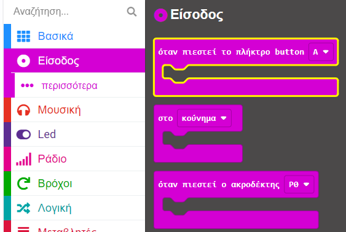
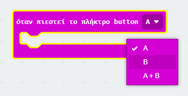
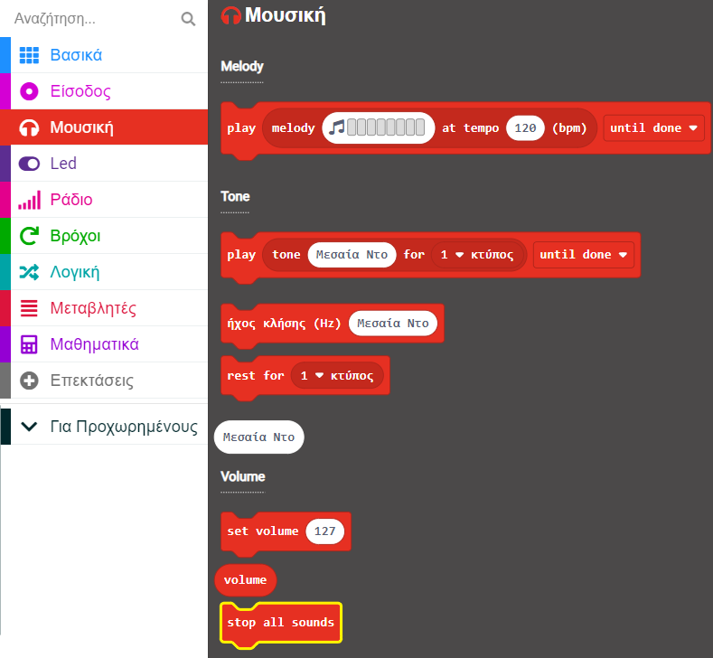
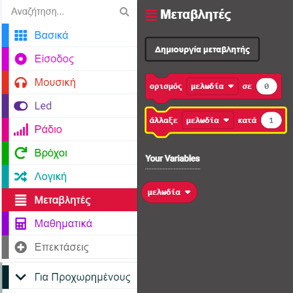

## Χρησιμοποίησε τα κουμπιά για να παραλείψεις μελωδίες

Αντί να αλλάξεις τη μελωδία αλλάζοντας την τιμή μεταβλητής `μελωδία` στο μπλοκ `κατά την έναρξη`, μπορείς να χρησιμοποιήσεις κουμπιά για να αλλάξεις την τιμή (και, επομένως, τη μελωδία).

Σε αυτό το βήμα, θα δημιουργήσεις κώδικα για να παραλείψεις κομμάτια χρησιμοποιώντας τους χειριστές συμβάντων του micro:bit.

<p style="border-left: solid; border-width:10px; border-color: #0faeb0; background-color: aliceblue; padding: 10px;">
Τι είναι ένα <span style="color: #0faeb0">χειριστής συμβάντων</span>;

Ένας χειριστής συμβάντων είναι κώδικας που εκτελείται όταν συμβεί ένα συγκεκριμένο συμβάν, όπως "όταν πιεστεί το πλήκτρο button A".

</p>

### Προσθήκη κουμπιών ελέγχου

Το micro:bit έχει ένα κουμπί `A` και ένα κουμπί `B`.

Μπορείς να χρησιμοποιήσεις ένα συμβάν για να ελέγξεις τι συμβαίνει όταν πατιέται ένα κουμπί.

### Μετάβαση στο επόμενο κομμάτι

Το κουμπί B βρίσκεται στα δεξιά του micro:bit, επομένως χρησιμοποίησε αυτό το κουμπί για να μεταβείς στο επόμενο κομμάτι.

Για να το κάνεις αυτό, πρέπει να αλλάξεις την τιμή της μεταβλητής `μελωδία`{:class="microbitvariables"} κατά `1`.

--- task ---

Από το μενού `Είσοδος`{:class="microbitinput"}, σύρε το μπλοκ `όταν πιεστεί το πλήκτρο button`{:class="microbitinput"} στον πίνακα επεξεργασίας κώδικα.



--- /task ---

--- task ---

Κάνε κλικ στο βέλος δίπλα στο `A`{:class="microbitinput"} στο μπλοκ `όταν πιεστεί το πλήκτρο button`{:class="microbitinput"}.

Άλλαξε το `A`{:class='microbitinput'} σε `B`{:class='microbitinput"}



--- /task ---

#### Διακοπή όλων των ήχων!

Τώρα, πρέπει να σταματήσεις την τρέχουσα μελωδία.

--- task ---

Από το μενού `Μουσική`{:class="microbitmusic"}, σύρε το μπλοκ `stop all sounds`{:class="microbitmusic"}.

Τοποθέτησέ το στο μπλοκ `όταν πιεστεί το κουμπί button [B]`{:class="microbitinput"} στον πίνακα επεξεργασίας κώδικα.



```microbit
input.onButtonPressed(Button.B, function () {
    music.stopAllSounds()
})
```

--- /task ---

--- task ---

Από το μενού `Μεταβλητές`{:class="microbitvariables"}, σύρε ένα μπλοκ `άλλαξε`{:class="microbitvariables"}.

Τοποθέτησέ το κάτω από το μπλοκ `stop all sounds`{:class="microbitmusic"}.



```microbit
let tune = 0
input.onButtonPressed(Button.B, function () {
    music.stopAllSounds()
    tune += 1
})
```

--- /task ---

#### Αντιμετώπιση του προβλήματος τιμών «εκτός εμβέλειας»

Εάν η τιμή της μεταβλητής είναι `4`, τότε αλλάζοντας την κατά `1` θα γίνει η τιμή `5`.

🚨 Αλλά δεν υπάρχει μελωδία που να σχετίζεται με την τιμή `5`! 🚨

Επειδή έχεις μόνο τέσσερις μελωδίες, εάν η μεταβλητή αλλάξει σε 5, πρέπει να επιστρέψεις στην πρώτη μελωδία.

```microbit
basic.forever(function () {
    let tune = 0
    if (tune == 1) {
        basic.showIcon(IconNames.Duck)
        music._playDefaultBackground(music.builtInPlayableMelody(Melodies.Dadadadum), music.PlaybackMode.UntilDone)
    } else if (tune == 2) {
        basic.showIcon(IconNames.Silly)
        music._playDefaultBackground(music.builtInPlayableMelody(Melodies.Punchline), music.PlaybackMode.UntilDone)
    } else if (tune == 3) {
        basic.showLeds(`
            . # . # .
            . # . # .
            # # # # #
            # # # # #
            # # # # #
            `)
        music._playDefaultBackground(music.builtInPlayableMelody(Melodies.Birthday), music.PlaybackMode.UntilDone)
    } else if (tune == 4) {
        basic.showIcon(IconNames.Skull)
        music._playDefaultBackground(music.builtInPlayableMelody(Melodies.Baddy), music.PlaybackMode.UntilDone)
    }
})
```

--- task ---

Από το μενού `Λογική`{:class="microbitlogic"} σύρε το μπλοκ `εάν`{:class="microbitlogic"}.

Τοποθέτησέ το κάτω από το μπλοκ `άλλαξε μελωδία`{:class='microbitvariables'} στον κώδικά σου.

```microbit
let tune = 0
input.onButtonPressed(Button.B, function () {
    music.stopAllSounds()
    tune += 1
    if (true) {

    }
})
```

--- /task ---

--- task ---

Επίσης, από το μενού `Λογική`{:class="microbitlogic"}, σύρε ένα μπλοκ `0 < 0`{:class="microbitlogic"}.

Τοποθέτησέ το μέσα στο `αληθές` μέσα στο μπλοκ `εάν`{:class='microbitlogic'}.

Άλλαξε το `<` (λιγότερο από) σε `>` (μεγαλύτερο από) κάνοντας κλικ στο βέλος δίπλα στο σύμβολο `<`.

```microbit
let tune = 0
input.onButtonPressed(Button.B, function () {
    music.stopAllSounds()
    tune += 1
    if (0 > 0) {

    }
})
```

--- /task ---

--- task ---

Από το μενού `Μεταβλητές`{:class="microbitvariables"}, σύρε το μπλοκ μεταβλητής `μελωδία`{:class="microbitvariables"}.

Τοποθέτησέ το στο πρώτο `0` στο μπλοκ `0 > 0`{:class="microbitlogic"}.

```microbit
let tune = 0
input.onButtonPressed(Button.B, function () {
    music.stopAllSounds()
    tune += 1
    if (tune > 0) {

    }
})
```

Άλλαξε το δεύτερο `0` σε `4`.

```microbit
let tune = 0
input.onButtonPressed(Button.B, function () {
    music.stopAllSounds()
    tune += 1
    if (tune > 4) {

    }
})
```

--- /task ---

--- task ---

Από το μενού `Μεταβλητές`{:class="microbitvariables"}, σύρε ένα μπλοκ `άλλαξε`{:class="microbitvariables"}.

Τοποθέτησέ το μέσα στο μπλοκ `εάν`{:class="microbitlogic"} στον κώδικά σου.

Άλλαξε το `0` σε `1`.

```microbit
let tune = 0
input.onButtonPressed(Button.B, function () {
    music.stopAllSounds()
    tune += 1
    if (tune > 4) {
        tune = 1
    }
})
```

--- /task ---


#### Μετάβαση στο προηγούμενο κομμάτι

Το κουμπί A βρίσκεται στα αριστερά του micro:bit, επομένως χρησιμοποίησε αυτό το κουμπί για να μεταβείς στο προηγούμενο κομμάτι.

Για να το κάνεις αυτό, πρέπει να αλλάξεις την τιμή της μεταβλητής `μελωδία`{:class="microbitvariables"} κατά `-1`.

Μπορείς να επαναχρησιμοποιήσεις τον κώδικα που δημιούργησες για να ελέγξεις τι συμβαίνει όταν πατηθεί το κουμπί B.

--- task ---

**Κάνε δεξί κλικ στο** στο επάνω μέρος του κουμπιού `όταν πιεστεί το πλήκτρο button B`{:class="microbitinput"} μπλοκ που έχεις τώρα στον πίνακα επεξεργασίας κώδικα.

Κάνε κλικ στο **Αντίγραφο** για να δημιουργήσεις ένα αντίγραφό του.

Θα πρέπει τώρα να έχεις ένα δεύτερο `όταν πιεστεί το πλήκτρο button`{:class="microbitinput"} που θα είναι "γκρίζο".

Άλλαξε το κουμπί από `B` σε `A`. Αυτή η ενέργεια θα επαναφέρει το χρώμα του μπλοκ, αντί να είναι γκρι.

```microbit
let tune = 0
input.onButtonPressed(Button.A, function () {
    music.stopAllSounds()
    tune += 1
    if (tune > 4) {
        tune = 1
    }
})
input.onButtonPressed(Button.B, function () {
    music.stopAllSounds()
    tune += 1
    if (tune > 4) {
        tune = 1
    }
})
```

--- /task ---

--- task --- Πραγματοποίησε αυτές τις αλλαγές στο μπλοκ `όταν πιεστεί το πλήκτρο button A`{:class="microbitinput"}:

Άλλαξε το `1` σε `-1` στο μπλοκ `άλλαξε`{:class="microbitvariables"}.

Στο μπλοκ σύγκρισης:

+ Άλλαξε το `>` σε `<`

+ Άλλαξε το `4` σε `1`

Άλλαξε το `1` σε `4` στο μπλοκ `ορισμός`{:class="microbitvariables"}.

--- /task ---


Θα πρέπει τώρα να έχεις ένα μπλοκ κώδικα `όταν πιεστεί το κουμπί button A`{:class="microbitinput"} κι ένα μπλοκ κώδικα `όταν πιεστεί το κουμπί button B`{:class="microbitinput"}:

```microbit
let tune = 0
input.onButtonPressed(Button.A, function () {
    music.stopAllSounds()
    tune += -1
    if (tune < 1) {
        tune = 4
    }
})
input.onButtonPressed(Button.B, function () {
    music.stopAllSounds()
    tune += 1
    if (tune > 4) {
        tune = 1
    }
})
```

--- task ---

**Εντοπισμός σφαλμάτων:** Βεβαιώσου ότι έχεις αλλάξει τις σωστές τιμές στα μπλοκ που χρησιμοποιούνται για την αλλαγή της τιμής των μεταβλητών.

Για παράδειγμα: Το `κουμπί A` πρέπει να αλλάζει τη μεταβλητή κατά `-1` και το κουμπί B πρέπει να αλλάζει την τιμή της μεταβλητής κατά `1`.

--- /task ---

--- task ---

Όταν κάνεις μια αλλαγή σε ένα μπλοκ στο πρόγραμμα επεξεργασίας κώδικα, ο προσομοιωτής θα επανεκκινήσει.

**Δοκίμασε το έργο σου**

+ Πάτησε το κουμπί A για να μεταβείς στο προηγούμενο κομμάτι

+ Πάτησε το κουμπί B για να μεταβείς στο επόμενο κομμάτι

--- /task ---


Μπράβο, τώρα μπορείς να μετακινηθείς στη λίστα των τραγουδιών σου εμπρός και πίσω!
