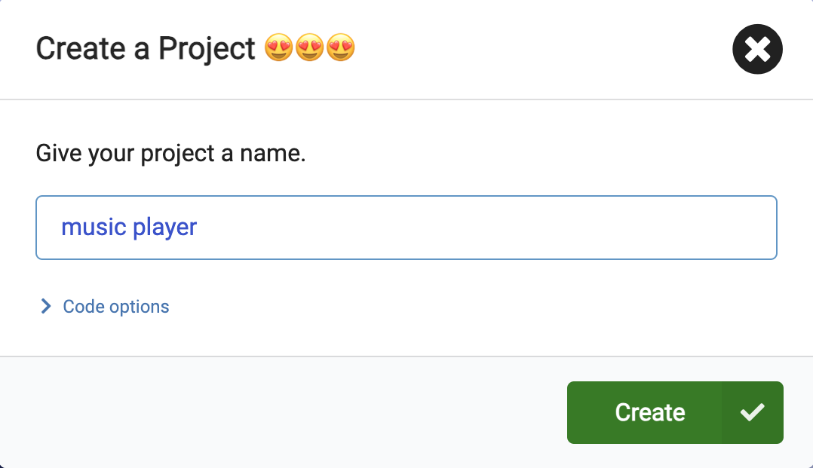
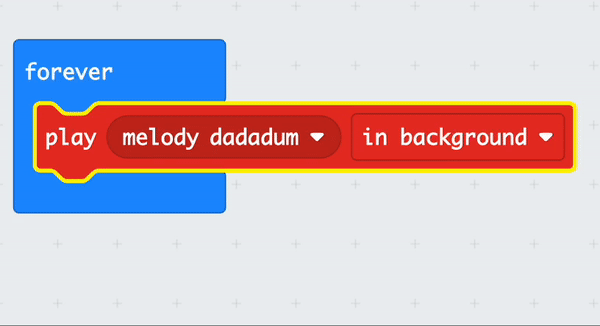

## Play a tune

### Opening MakeCode

To start creating your micro:bit project, you need to open the MakeCode editor.

--- task ---

Open the MakeCode editor at [makecode.microbit.org](https://makecode.microbit.org){:target="_blank"}

--- collapse ---

---
title: Offline version of the editor
---

There is also a [downloadable version of the MakeCode editor](https://makecode.microbit.org/offline-app){:target="_blank"}.

--- /collapse ---

--- /task ---

### First micro:bit project?

[[[makecode-tour]]]

### Create your project

Once the editor is open, you will need to create a new project and give your project a name. 

--- task ---

Click on the **New Project** button.

--- /task ---

--- task ---

Give your new project the name `music player` and click **Create**.

**Tip:** Give your project a helpful name that relates to the activity you’re creating. This will make it easier to find if you create other projects on MakeCode.

--- /task ---

### Play melody

You are going to use the <code style="background-color: #1E90FF">forever</code> block to make use of the speaker output on the micro:bit (V2 users only).

--- collapse ---
---
title: V1 micro:bit users
---

The speaker output is only available on the V2 of the micro:bit. You will need to connect external headphones/speakers to play sound on the V1. You will still be able to play the sound on the simulator.

There is a [guide to connecting headphones/speakers to the V1 micro:bit.](https://makecode.microbit.org/projects/hack-your-headphones/make){:target="_blank"}.

--- /collapse ---

--- task ---

From the <code style="background-color: #E63022">Music</code> menu, drag the <code style="background-color: #E63022">play melody dadadum</code> block and place it inside the <code style="background-color: #1E90FF">forever</code> block.

--- /task ---

--- task ---

On the <code style="background-color: #E63022">play melody dadadum</code> block, click on the down arrow next to `in background`. 

Choose `until done`.

--- /task ---

### Style your song

As well as playing a melody, you can add a picture to the LED display to add some more style! 

--- task ---

Open the <code style="background-color: #1e90ff">Basic</code> menu and find the <code style="background-color: #1e90ff">show icon</code> block.

--- /task ---

--- task ---

Drag the <code style="background-color: #1e90ff">show icon</code> block into the code editor. 

Place it inside the <code style="background-color: #1e90ff">forever</code> block **above** your <code style="background-color: #e63022">melody</code> block. 

--- /task ---

--- task ---

MakeCode has pre-programmed icons to display on the LED. 

The default is a **heart** icon. 

**Click** on the heart to see the other options. 

**Choose** an icon that represents your melody. 

We have gone for this little duck! 

<iframe style="position:relative;top:0;left:0;width:100%;height:100%;" src="https://makecode.microbit.org/---codeembed#pub:_7LdLvFhbzYuD" allowfullscreen="allowfullscreen" frameborder="0" sandbox="allow-scripts allow-same-origin"></iframe>

--- /task ---

--- task ---

When you make a change to a code block in the code editor panel, the simulator will restart.

**Test your program** 

+ You should now hear the melody playing until it's done (and then looping because of the forever loop).
+ You should also see the icon you chose displayed on the LEDs

--- /task ---    

Well done, you have created your first music program on a micro:bit!
