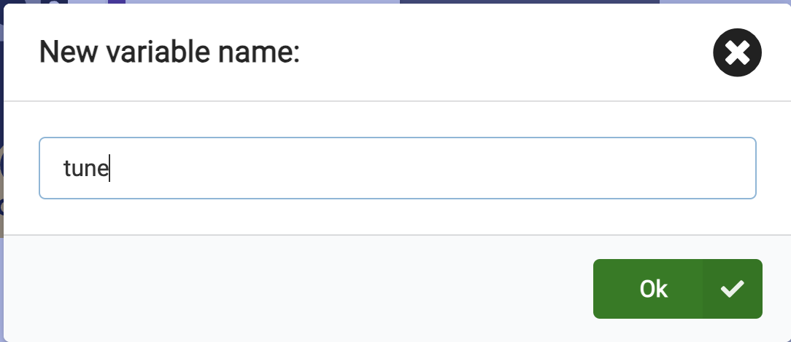
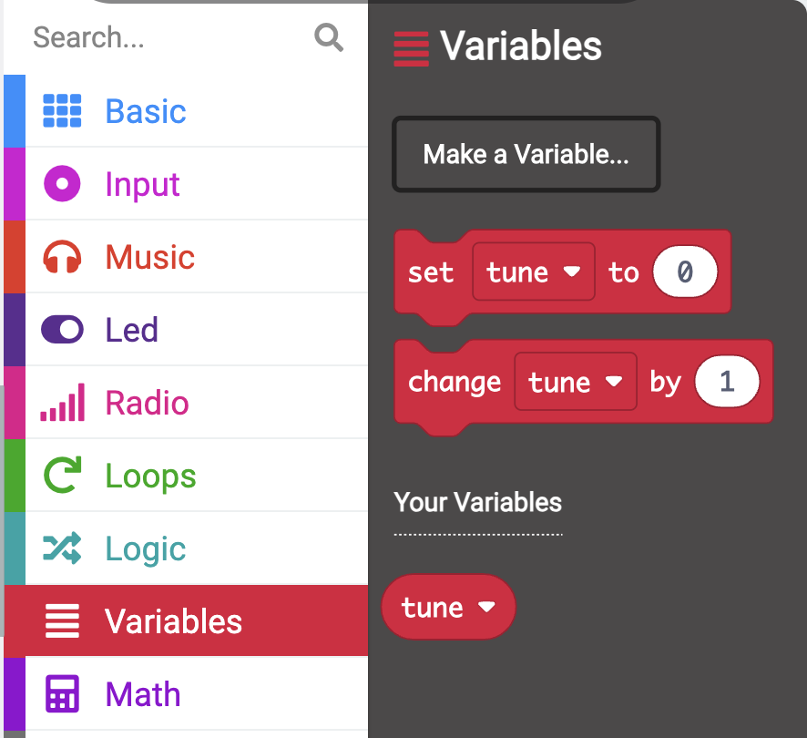
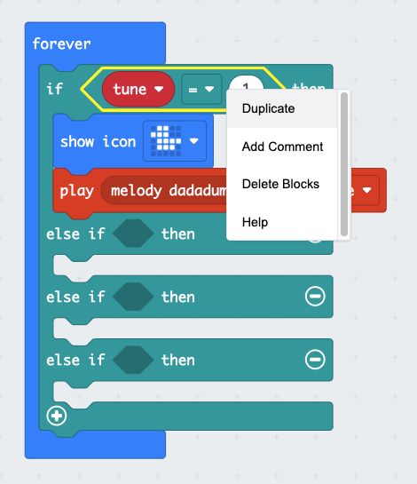
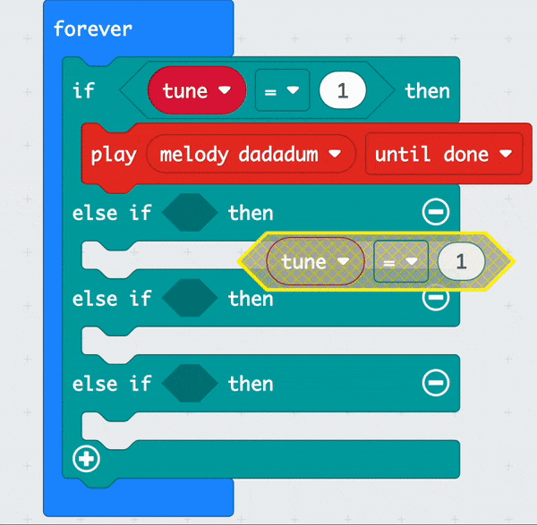
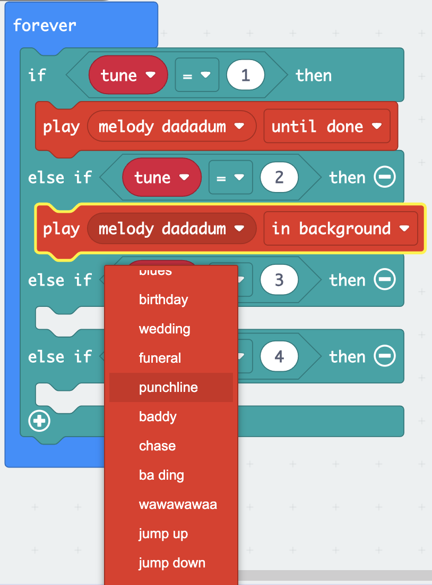

## Allowing Choices

### Creating a variable

Throughout creating your music player, you will need to use variables. 

What is a variable?

A variable is like a special box where we can keep different pieces of information. Sometimes it might hold a number like `10` or it might hold a word like `dinosaur`.

--- task ---

Click on the `Variables` block menu to expand it. When open, click on the `Make a Variable` button.

--- /task ---

--- task ---

Name your variable `tune`, then click the `OK` button.

--- /task ---

There will now be new blocks available that you can use to set, change or use the value stored in the `tune` variable. 

--- task ---

Drag out the `set [tune] to 0` block inside the `on start` block and change the `0` to `1`.

<iframe style="position:relative;top:0;left:0;width:75%;height:75%;" src="https://makecode.microbit.org/---codeembed#pub:_MHwLMFgh3Duz" allowfullscreen="allowfullscreen" frameborder="0" sandbox="allow-scripts allow-same-origin"></iframe>

--- /task ---

### Using if... then

In order for your music player to play different melody choices, you will need to make use of a logic block for each melody.

--- task ---

From the Logic block menu, click on the `if.. true.. then` block and drag it inside the `forever` block. It should click in place above the `play melody... dadadum.. until forever` block

--- /task ---

--- task ---

Click on the Logic block menu again and this time, you will need to drag out a comparison `0=0` block. Drag this into the `true` area on the `if.. true.. then` block and make sure it fits in place.

<iframe style="position:relative;top:0;left:0;width:75%;height:75%;" src="https://makecode.microbit.org/---codeembed#pub:_WrzDXU4KKeRY" allowfullscreen="allowfullscreen" frameborder="0" sandbox="allow-scripts allow-same-origin"></iframe>

--- /task ---

--- task ---

From the Variables block menu, drag out a `tune` variable block. Place it into the first `0` area on the comparison block inside the C. Change the second `0` to `1`.

<iframe style="position:relative;top:0;left:0;width:75%;height:75%;" src="https://makecode.microbit.org/---codeembed#pub:_HyH5uA1iA80o" allowfullscreen="allowfullscreen" frameborder="0" sandbox="allow-scripts allow-same-origin"></iframe>

--- /task ---

--- task ---

Now click on the `play melody... dadadum.. until done` block and place it inside the `if.. tune = 0.. then` block.

<iframe style="position:relative;top:0;left:0;width:75%;height:75%;" src="https://makecode.microbit.org/---codeembed#pub:_40uahb1ahe5k" allowfullscreen="allowfullscreen" frameborder="0" sandbox="allow-scripts allow-same-origin"></iframe>

--- /task ---

To add more melody choices, you need to create more conditions within the `if.. true.. then` block. This will create `else.. if` conditions.

--- task ---

Click on the `+` symbol on the bottom left of the `if... then` block. This will create an `else` block. 

--- /task ---

--- task ---

Click on the `+` symbol below the  `else` block. This will create an `else if... then` block. Repeat this two more times until you have three `else if... then` blocks.

--- /task ---

--- task ---

Now click on the `-` symbol next to the `else` block to remove the `else` block.

--- /task ---

--- task ---

Right click on the entire comparison `tune = 1` block and then duplicate it.

--- /task ---

--- task ---

Place the duplicated comparison block inside the empty shaped space on the first `else if.. then` block. Duplicate more comparison blocks and repeat placing them inside the empty shaped spaces on the two remaining `else if.. then` blocks.

--- /task ---

--- task ---

Inside the first `else if.. then` block, change the `tune = 1` comparison from `1` to `2`.

Repeat this for the second, change the `tune = 1` comparison from `1` to `3` and then repeat this one more time change the `tune = 1` comparison from `1` to `4`

<iframe style="position:relative;top:0;left:0;width:75%;height:75%;" src="https://makecode.microbit.org/---codeembed#pub:_HM28gkfiieR4" allowfullscreen="allowfullscreen" frameborder="0" sandbox="allow-scripts allow-same-origin"></iframe>

--- /task ---

You will now need to select a different melody for each `else if.. then` block. This will mean each time the variable value is changed, a different melody will play.

--- task ---

From inside the Music block menu, drag out a `play melody... dadadum.. in background` block. Place it below the first `else if.. then` block.

Click on the down arrow next to `melody dadadum` to see more melody options. You can scroll to view all the available melodies. Choose a melody of your choice. 

--- /task ---

--- task ---

Change the `in background` option to `until done` on your newly selected melody block. We have chosen `melody punchline` in our example.

<iframe style="position:relative;top:0;left:0;width:75%;height:75%;" src="https://makecode.microbit.org/---codeembed#pub:_edEDeFfasJuL" allowfullscreen="allowfullscreen" frameborder="0" sandbox="allow-scripts allow-same-origin"></iframe>

--- /task ---

--- task ---

Right click and Duplicate the second `play melody... punchline.. until done` block. Place it below the second `else if.. then` block. 

Ensure you change the melody from `melody punchline` to another choice,

Repeat these steps one more time for the third, `else if.. then` block. You should now have four melodies for the four conditions.

<iframe style="position:relative;top:0;left:0;width:75%;height:75%;" src="https://makecode.microbit.org/---codeembed#pub:_f5DefxebuH6c" allowfullscreen="allowfullscreen" frameborder="0" sandbox="allow-scripts allow-same-origin"></iframe>

--- /task ---

--- task ---

**Debug:** Ensure you have changed all the comparison operators after duplicating them, so you have `1` in the `if.. then` block and then `2,3,4` in the other `else if` blocks.

When you make a change to a code block in the code editor panel, the simulator will restart.

**Test:** Change the variable value from `1` to `2` in the `set tune to 1` on the `on start block`. You should hear a different melody play.

You can also change the variable value to `3` then `4` to hear your other chosen melodies play.

**Change:** the variable value back to `1` to reset the tune for the next step.

Well done, you have chosen different melodies for your music player.

--- /task ---

--- save ---