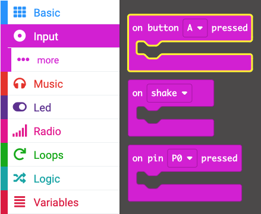

## Using the buttons to skip tunes

Instead of changing the melody by changing the `tune` variable value in the `on start` block, you can use buttons to change the value (and, therefore, the melody). 

In this step you will create code to skip tracks using the micro:bit's `A` and `B` buttons: 

<iframe style="position:relative;top:0;left:0;width:50%;height:50%;" src="https://makecode.microbit.org/---run?id=_aJjUJwKmE3kj" allowfullscreen="allowfullscreen" sandbox="allow-popups allow-forms allow-scripts allow-same-origin" frameborder="0"></iframe>

### Adding button controls

The micro:bit contains an `A` button, and a `B` button.

You can use a block to control what happens when a button is pressed.

--- task ---

Click on the `Input` block menu to expand it and drag the `on button [A] pressed` block to the code editor panel.

--- /task ---

#### Stop all sounds!

First, we need to stop the current tune. 

--- task ---

Click on the `Music` block menu to expand it and drag the `stop all sounds` block to the `on button [A] pressed` block in the code editor panel.

<iframe style="position:relative;top:0;left:0;width:50%;height:50%;" src="https://makecode.microbit.org/---codeembed#pub:_6FTWXk9WTLym" allowfullscreen="allowfullscreen" frameborder="0" sandbox="allow-scripts allow-same-origin"></iframe>

--- /task ---

#### Increase the value of the variable

Button A is on the left, so we will use this button to skip to the previous track.

To do this we need to change the value of the `tune` variable by `-1`.

--- task ---

Click on the `Variables` block menu to expand it and drag the `change [tune] by [1]` block below the `stop all sounds` block in your code.

In the `change [tune] to [1]` block, change the value `1` to `-1`.

<iframe style="position:relative;top:0;left:0;width:75%;height:75%;" src="https://makecode.microbit.org/---codeembed#pub:_bk1aXfP6ob1E" allowfullscreen="allowfullscreen" frameborder="0" sandbox="allow-scripts allow-same-origin"></iframe>

--- /task ---

#### Dealing with 'out of range'

If the value of the variable is `1`, then changing it by `-1` will make the value `0`.
(1 - 1 = 0)

🚨 But there is no melody associated with the value `0`! 🚨

And if you keep going, you will go from 0 to -1, then -2, -3, -4, -5 and so on!

We need to deal with this and stop this from happening!

We need to make sure the lowest number that the variable value can be is `1`, because our melodies start at 1:

<iframe style="position:relative;top:0;left:0;width:100%;height:100%;" src="https://makecode.microbit.org/---codeembed#pub:_HM28gkfiieR4" allowfullscreen="allowfullscreen" frameborder="0" sandbox="allow-scripts allow-same-origin"></iframe>

--- task ---

Click on the `Logic` block menu to expand it and drag the `if <true> then` block below the `change [tune] by [1]` block in your code.

Also from the `Logic` block menu, drag a `0 < 0` block over the `<true>` part of the `if <true> then` block.

Click on the `Variables` block menu to expand it and drag the `tune` variable value block to the first `0` in the `0 < 0` block.

Change the second `0` to a `1`.

Click on the `Variables` block menu to expand it and drag the `set [tune] to 0` block inside the `if [tune] < 1 then` block in your code. 

Change the `0` to `4`.

Your code should look like this:

<iframe style="position:relative;top:0;left:0;width:75%;height:75%;" src="https://makecode.microbit.org/---codeembed#pub:_TkfFaLTMeRW5" allowfullscreen="allowfullscreen" frameborder="0" sandbox="allow-scripts allow-same-origin"></iframe>

--- /task ---

#### Decreasing the  the value of the variable

Button B is on the right, so we will use this button to skip to the next track.

To do this we need to change the value of the `tune` variable by `1`.

We can re-use our code we created to control what happens when Button A is pressed.

--- task ---

**Right click** on the top part of the `on button A pressed` block that you now have in the code editor panel. 

Click `Duplicate` to make a copy of the whole block. 

Make these changes:

+ Change the button from A to B
+ Change the `-1` to `1`
+ Change the `<` to `>`
+ Change the `1` to `4`
+ Change the `4` to `1`

Your code should look like this:

<iframe style="position:relative;top:0;left:0;width:75%;height:75%;" src="https://makecode.microbit.org/---codeembed#pub:_CbfbVkYrt0iW" allowfullscreen="allowfullscreen" frameborder="0" sandbox="allow-scripts allow-same-origin"></iframe>

--- /task ---

**Debug** Make sure you have changed the correct values in the blocks used to change the value of the variables. For example: `Button A` should change the variable by `-1` and Button B should change the variable value by `1`.

When you make a change to a code block in the code editor panel, the simulator will restart.

**Test** When the program runs, you should now be able to change the tune by pressing the buttons.

Well done, you can now skip your tracks!
