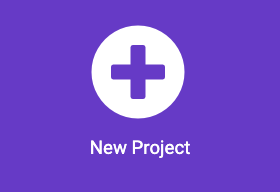

## Reproduce una melodía

### Abre MakeCode

Para empezar a crear tu proyecto en micro:bit, necesitas abrir el editor MakeCode.

--- task ---

Abre el editor MakeCode en [makecode.microbit.org](https://makecode.microbit.org){:target="_blank"}.

--- collapse ---

---
título: Versión sin conexión del editor
---

Tambien hay una [version descargable del editor MakeCode](https://makecode.microbit.org/offline-app){:target="_blank"}.

--- /collapse ---

--- /task ---

### ¿Primer proyecto de micro:bit?

[[[makecode-tour]]]

### Crea tu proyecto

Una vez que el editor esta abierto, necesitaras crear un nuevo proyecto y asignarle un nombre.

--- task ---

Da click en el boton **Nuevo Proyecto**.



--- /task ---

--- task ---

Dale a tu nuevo proyecto el nombre `reproductor de música` y haz clic en **Crear**.


**Consejo:** Para que sea más fácil encontrar tu proyecto más adelante, asígnale un nombre útil que se relacione con la actividad que estás creando.

--- /task ---

### Reproducir melodía


Vas a utilizar el bloque `forever`{:class="microbitbasic"} para utilizar la salida del altavoz en el micro:bit (sólo usuarios de V2).

--- collapse ---
---
título: Usuarios de micro:bit V1
---

La salida del altavoz solo está disponible en el micro:bit V2. Necesitará conectar auriculares/altavoces externos para reproducir sonido en el V1. Aún podrás reproducir el sonido en el simulador.

Hay una guía [para conectar auriculares/altavoces al micro:bit V1](https://makecode.microbit.org/projects/hack-your-headphones/make){:target="_blank"}.

--- /collapse ---


--- task ---

Del menú `Música`{:class="microbitmusic"}, arrastra el bloque `reproducir melody dadadum`{:class="microbitmusic"} y colócalo dentro del bloque `para siempre`{:class="microbitbasic"}.


--- /task ---

--- task ---

Haz clic en la flecha hacia abajo junto a `en segundo plano` en el bloque `reproducir el dadadum melodia`{:class='microbitmusic'}.

Elige `hasta que termines`.


--- /task ---

### Dale estilo a tu canción

¡Además de reproducir una melodía, puedes agregar una imagen a la pantalla LED para agregarle más estilo!

--- task ---

Abra el menú `Básico`{:class="microbitbasic"} y busque el bloque `mostrar ícono`{:class="microbitbasic"}.


--- /task ---

--- task ---

Arrastre el bloque `mostrar ícono`{:class="microbitbasic"} al editor de código.

Colóquelo dentro el bloque `para siempre `{:class="microbitbasic"} **sobre** el bloque de tu `melodia`{:class="microbitmusic"}.

--- /task ---

--- task ---

MakeCode tiene íconos preprogramados que se muestran en el panel LED.

El valor predeterminado es un ícono de corazón ****.

**Haga clic en** en el corazón para ver las otras opciones.

**Elige** un ícono que represente tu melodía.


¡Hemos elegido este patito!

```microbit
basic.forever(function () {
    basic.showIcon(IconNames.Duck)
    music._playDefaultBackground(music.builtInPlayableMelody(Melodies.Dadadadum), music.PlaybackMode.UntilDone)
})
```

--- /task ---

--- task ---

Cuando haces un cambio a un bloque de codigo en el panel del editor de codigo, el simulador se reiniciara.

**Prueba tu programa**

+ Ahora deberías escuchar la melodia hasta que termine (y luego hacer un bucle debido al bucle para siempre)
+ También deberías ver el icono que elegiste en los LEDs

--- /task ---

¡Bien hecho, has creado tu primer programa de música en un micro:bit!
