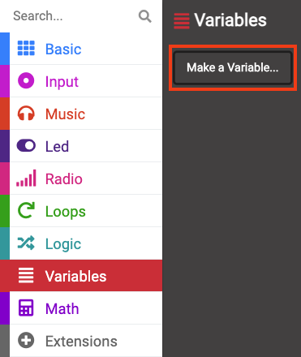
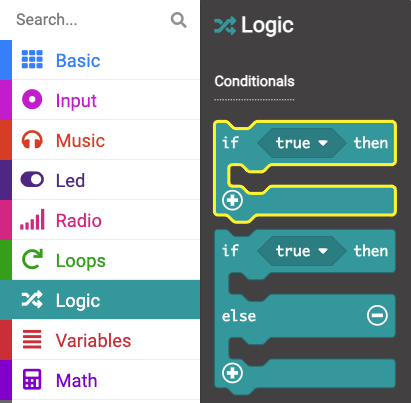

## Permitir opciones

### Crear una variable

Durante todo el proceso de creación de su reproductor de música, necesitará utilizar variables.

<p style="border-left: solid; border-width:10px; border-color: #0faeb0; background-color: aliceblue; padding: 10px;">
¿Qué es una variable <span style="color: #0faeb0">?</span>

Una variable es una forma de etiquetar y almacenar datos en sus programas. Su programa puede usar y cambiar los datos almacenados en una variable cuando se ejecuta.

Los datos almacenados en una variable pueden ser un número como "10" o una palabra como "dinosaurio".</p>

--- task ---

Abre el menu `Variables`{:class='microbitvariables'} y haz click en **Crear una Variable**.



--- /task ---

--- task ---

Nombra la nueva variable `tunada`{:class="microbitvariables"}, luego haga clic en el botón **OK**.


--- /task ---

Ahora habrá nuevos bloques disponibles que puedes usar para configurar, cambiar o usar el valor almacenado en la variable `tune`{:class="microbitvariables"}.


--- task ---

Arrastra el bloque `fijar`{:class="microbitvariables"} y colócalo dentro del bloque `al iniciar`{:class="microbitbasic"}.

Cambie `0` a `1`.

```microbit
let tune = 1
```

--- /task ---

### Uso de si...entonces

Para que tu reproductor de música reproduzca diferentes opciones de melodía, tendrás que hacer uso de un bloque lógico para cada melodía.

--- task ---

Desde el menú `Lógica`{:class="microbitlogic"}, elija el bloque `si`{:class="microbitlogic"}.



--- /task ---

--- task ---

Coloque el bloque `if`{:class="microbitlogic"} encima del bloque `show icon`{:class="microbitbasic"}.

Haga clic en el menú `Lógica`{:class="microbitlogic"} y arrastre un bloque de comparación `0 = 0`{:class="microbitlogic"}.

Coloque esto en el área `verdadero`{:class="microbitlogic"} del bloque `si`{:class="microbitlogic"}.

```microbit
básico.por siempre(función () {
    si (0 == 0) {

    }
    básico.mostrarIcono(NombresDeIcono.Pato)
    música._playDefaultBackground(música.builtInPlayableMelody(Melodías.Dadadadum), música.ModoDeReproducción.HastaQueSeAcabe)
})
```

--- /task ---

--- task ---

Desde el menu `Variables`{:class='microbitvariables'}, obten el bloque `fijar a`{:class='microbitvariables'}.

Colóquelo en el primer `0` del bloque `0 = 0`{:class="microbitlogic"}.

Cambia el segundo `0` a `1`.

```microbit
basic.forever(function () {
    let tune = 0
    if (tune == 1) {

    }
    basic.showIcon(IconNames.Duck)
    music._playDefaultBackground(music.builtInPlayableMelody(Melodies.Dadadadum), music.PlaybackMode.UntilDone)
})
```

--- /task ---

--- task ---

Mueva los bloques `mostrar ícono`{:class="microbitbasic"} y `reproducir melodía`{:class="microbitmusic"} dentro del bloque `si`{:class="microbitlogic"}.

**Consejo:** Siempre que agarres un bloque, todos los bloques debajo de él también se moverán, así que simplemente arrastra el bloque `mostrar ícono`{:class="microbitbasic"} y los demás lo seguirán.

```microbit
basic.forever(function () {
    let tune = 0
    if (tune == 1) {
        basic.showIcon(IconNames.Duck)
        music._playDefaultBackground(music.builtInPlayableMelody(Melodies.Dadadadum), music.PlaybackMode.UntilDone)
    }
})
```

--- /task ---

Para agregar más opciones de melodía, debe crear más condiciones en el bloque `if`{:class="microbitlogic"}.

--- task ---

Haga clic en el símbolo `+` en la parte inferior izquierda del bloque `if`{:class="microbitlogic"}. Esto creará una sección `else`{:class="microbitlogic"}.

--- /task ---

--- task ---

Haga clic en el símbolo `+` debajo de la sección `de lo contrario`{:class="microbitlogic"}.

Esto creará una sección `else if`{:class="microbitlogic"}.

Repita esto dos veces, de modo que tenga tres secciones `else if`{:class="microbitlogic"} y una sección `else`{:class="microbitlogic"}.

--- /task ---

--- task ---

Haga clic en el símbolo `-` junto a la sección `else`{:class="microbitlogic"} para eliminar la sección `else`{:class="microbitlogic"}.


--- /task ---

--- task ---

Haga clic con el botón derecho del ratón en la tecla ``{:class="microbitvariables"} `=`{:class="microbitlógica"} `1` bloque y duplicarlo.


--- /task ---

--- task ---

Coloque la melodía duplicada ``{:class="microbitvariables"} `=`{:class="microbitlogic"} `1` entre el primer bloque `de lo contrario si`{:class="microbitlogic"} y `entonces`{:class="microbitlogic"}.

Duplique dos bloques de comparación más y colóquelos entre las otras partes `else if`{:class="microbitlogic"} y `then`{:class="microbitlogic"}.

```microbit
basic.forever(function () {
    let tune = 0
    if (tune == 1) {
        basic.showIcon(IconNames.Duck)
        music._playDefaultBackground(music.builtInPlayableMelody(Melodies.Dadadadum), music.PlaybackMode.UntilDone)
    } else if (tune == 1) {

    } else if (tune == 1) {

    } else if (tune == 1) {

    }
})
```

--- /task ---

--- task ---

Dentro de la primera sección `else if`{:class="microbitlogic"}, cambie `1` a `2`.

Para la segunda sección `else if`{:class="microbitlogic"}, cambie `1` a `3`.

Para la tercera sección `else if`{:class="microbitlogic"}, cambie `1` a `4`.

```microbit
basic.forever(function () {
    let tune = 0
    if (tune == 1) {
        basic.showIcon(IconNames.Duck)
        music._playDefaultBackground(music.builtInPlayableMelody(Melodies.Dadadadum), music.PlaybackMode.UntilDone)
    } else if (tune == 2) {

    } else if (tune == 3) {

    } else if (tune == 4) {

    }
})
```

--- /task ---

Ahora debes seleccionar una melodía diferente para cada sección `else if`{:class="microbitlogic"}.

Cada vez que se cambia el valor de la variable, se reproducirá una melodía diferente.

--- task ---

Duplica el bloque `reproducir melodía dadadum`{:class="microbitmusic"}.

Coloque el bloque duplicado dentro de la primera sección `else if`{:class="microbitlogic"}.

Haga clic en la flecha junto a `melodía dadadum`{:class="microbitmusic"} para ver más opciones de melodía.

Desplácese para ver todas las melodías y elija una.

Repita estos pasos para la segunda y tercera sección `else if`{:class="microbitlogic"}.

Ahora deberías tener cuatro melodías, una para cada una de las cuatro condiciones.

```microbit
basic.forever(function () {
    let tune = 0
    if (tune == 1) {
        music._playDefaultBackground(music.builtInPlayableMelody(Melodies.Dadadadum), music.PlaybackMode.UntilDone)
        basic.showIcon(IconNames.Duck)
    } else if (tune == 2) {
        music._playDefaultBackground(music.builtInPlayableMelody(Melodies.Punchline), music.PlaybackMode.UntilDone)
    } else if (tune == 3) {
        music._playDefaultBackground(music.builtInPlayableMelody(Melodies.Birthday), music.PlaybackMode.UntilDone)
    } else if (tune == 4) {
        music._playDefaultBackground(music.builtInPlayableMelody(Melodies.Baddy), music.PlaybackMode.UntilDone)
    }
})
```

--- /task ---

También debes seleccionar algunos íconos **** para cada una de tus nuevas canciones.

Puedes duplicar el bloque `mostrar ícono`{:class="microbitbasic"}.

¡También puedes usar el bloque `muestra leds`{:class="microbitbasic"} para dibujar el tuyo propio!

--- collapse ---

---
título: El bloque mostrar leds
---

Dentro del menú `Básico`{:class="microbitbasic"}, encuentra el bloque `mostrar leds`{:class="microbitbasic"} y arrástralo dentro de un `si no fuera`{:class="microbitlogic"} para usarlo.


Puedes hacer clic en cada uno de los cuadrados para dibujar tu imagen. Los cuadrados blancos se iluminarán en el micro:bit.

Dibujamos un pastel de cumpleaños **** para la melodía del cumpleaños ``.


--- /collapse ---

--- task ---

Agrega íconos para cada una de tus canciones usando el bloque `mostrar ícono`{:class="microbitbasic"} o `mostrar leds`{:class="microbitbasic"}.

```microbit
basic.forever(function () {
    let tune = 0
    if (tune == 1) {
        basic.showIcon(IconNames.Duck)
        music._playDefaultBackground(music.builtInPlayableMelody(Melodies.Dadadadum), music.PlaybackMode.UntilDone)
    } else if (tune == 2) {
        basic.showIcon(IconNames.Silly)
        music._playDefaultBackground(music.builtInPlayableMelody(Melodies.Punchline), music.PlaybackMode.UntilDone)
    } else if (tune == 3) {
        basic.showLeds(`
            . # . # .
            . # . # .
            # # # # #
            # # # # #
            # # # # #
            `)
        music._playDefaultBackground(music.builtInPlayableMelody(Melodies.Birthday), music.PlaybackMode.UntilDone)
    } else if (tune == 4) {
        basic.showIcon(IconNames.Skull)
        music._playDefaultBackground(music.builtInPlayableMelody(Melodies.Baddy), music.PlaybackMode.UntilDone)
    }
})
```

--- /task ---

--- task ---

**Depuración:** Asegúrese de haber cambiado todos los números en las comparaciones después de duplicarlas.

Debes tener `1` en la sección `if`{:class="microbitlogic"} y luego `2, 3, 4` en las secciones `else if`{:class="microbitlogic"}.

--- /task ---

--- task ---

Cuando haces un cambio a un bloque de codigo en el panel del editor de codigo, el simulador se reiniciara.

**Prueba tu programa**

+ Cambie la melodía establecida ``{:class="microbitvariables"} de `1` a `2` en el bloque `de inicio`{:class="microbitbasic"}. El simulador reiniciará y reproducirá la melodía por 2, y mostrará ese icono.

+ Repita los mismos pasos para las melodías 3 y 4.

+ Asegúrese de cambiar la melodía establecida ``{:class="microbitvariables"} a `1` al final de sus pruebas.

¡Bien hecho, has elegido diferentes melodías para tu reproductor de música!

--- /task ---
