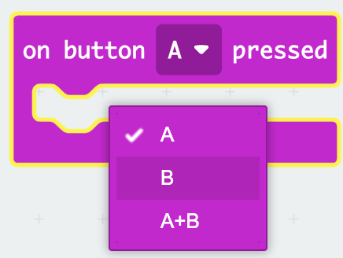
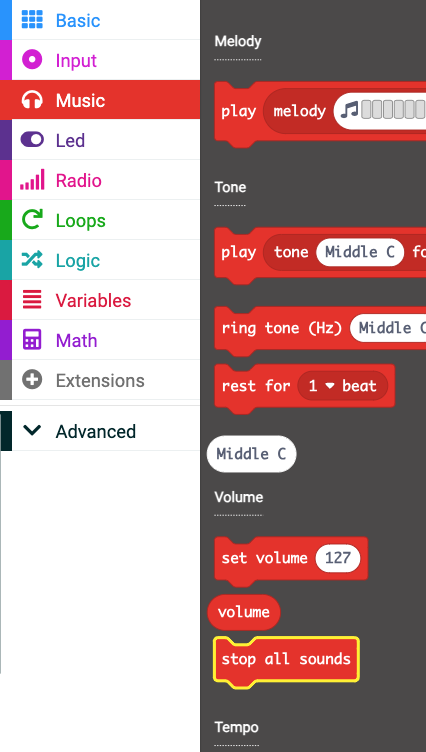
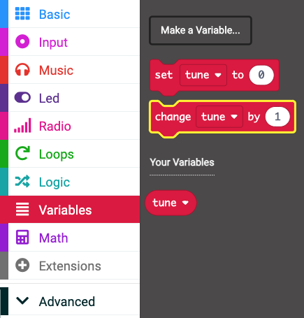

## Utilice los botones para saltar melodías

En lugar de cambiar la melodía modificando el valor de la variable `melodía` en el bloque `al inicio`, puedes usar botones para cambiar el valor (y, por lo tanto, la melodía).

En este paso, crearás código para omitir pistas usando los controladores de eventos del micro:bit.

<p style="border-left: solid; border-width:10px; border-color: #0faeb0; background-color: aliceblue; padding: 10px;">
¿Qué es un controlador de eventos <span style="color: #0faeb0"></span>?

Un controlador de eventos es un código que se ejecutará cuando ocurra un evento particular, como “botón A presionado”.

</p>

### Agrega un botón de control

El micro:bit tiene un Botón `A` y un Botón `B`.

Puedes usar un evento para controlar lo que sucede cuando se presiona un botón.

### Ir a la siguiente pista

El botón B está a la derecha del micro:bit, así que usa este botón para saltar a la siguiente pista.

Para hacer esto, necesitas cambiar el valor de la variable `ajuste`{:class="microbitvariables"} por `1`.

--- task ---

Desde el menú `Entrada`{:class="microbitinput"}, arrastra el bloque `en el botón`{:class="microbitinput"} al panel del editor de código.


--- /task ---

--- task ---

Haga clic en la flecha junto a `A`{:class="microbitinput"} en el botón `en el bloque`{:class="microbitinput"}.

Cambie `A`{:class="microbitinput"} a `B`{:class="microbitinput"}



--- /task ---

#### ¡Detén todos los sonidos!

Ahora, debes detener la melodía actual.

--- task ---

Desde el menú `Música`{:class="microbitmusic"}, arrastre el bloque `detener todos los sonidos`{:class="microbitmusic"}.

Colóquelo en el bloque `del botón [B]`{:class="microbitinput"} en el panel del editor de código.



```microbit
input.onButtonPressed(Button.B, function () {
    music.stopAllSounds()
})
```

--- /task ---

--- task ---

Del menú `Variables`{:class="microbitvariables"}, arrastra el bloque `cambiar`{:class="microbitvariables"}.

Colóquelo debajo del bloque `detener todos los sonidos`{:class="microbitmusic"}.



```microbit
let tune = 0
input.onButtonPressed(Button.B, function () {
    music.stopAllSounds()
    tune += 1
})
```

--- /task ---

#### Cómo lidiar con el "fuera de rango"

Si el valor de la variable es `4`, entonces cambiarlo por `1` hará que el valor sea `5`.

🚨 ¡Pero no hay ninguna melodía asociada con el valor `5`! 🚨

Debido a que usted sólo tiene cuatro melodias, si la variable cambia a 5, usted necesita volver a la primera melodía.

```microbit
basic.forever(function () {
    let tune = 0
    if (tune == 1) {
        basic.showIcon(IconNames.Duck)
        music._playDefaultBackground(music.builtInPlayableMelody(Melodies.Dadadadum), music.PlaybackMode.UntilDone)
    } else if (tune == 2) {
        basic.showIcon(IconNames.Silly)
        music._playDefaultBackground(music.builtInPlayableMelody(Melodies.Punchline), music.PlaybackMode.UntilDone)
    } else if (tune == 3) {
        basic.showLeds(`
            . # . # .
            . # . # .
            # # # # #
            # # # # #
            # # # # #
            `)
        music._playDefaultBackground(music.builtInPlayableMelody(Melodies.Birthday), music.PlaybackMode.UntilDone)
    } else if (tune == 4) {
        basic.showIcon(IconNames.Skull)
        music._playDefaultBackground(music.builtInPlayableMelody(Melodies.Baddy), music.PlaybackMode.UntilDone)
    }
})
```

--- task ---

Desde el menu `Logica`{:class='microbitlogic'}, obten un bloque `si`{:class='microbitlogic'}.

Colócala debajo del bloque `cambiar la melodia`{:class="microbitvariables"} en tu código.

```microbit
let tune = 0
input.onButtonPressed(Button.B, function () {
    music.stopAllSounds()
    tune += 1
    if (true) {

    }
})
```

--- /task ---

--- task ---

También desde el menú `Lógica`{:class="microbitlogic"}, arrastre un bloque `0 < 0`{:class="microbitlogic"}.

Colóquelo dentro de la parte `verdadera` del bloque `si`{:class="microbitlogic"}.

Cambie `<` (menor que) a `>` (mayor que) haciendo clic en la flecha junto al símbolo `<`.

```microbit
let tune = 0
input.onButtonPressed(Button.B, function () {
    music.stopAllSounds()
    tune += 1
    if (0 > 0) {

    }
})
```

--- /task ---

--- task ---

Desde el menu `Variables`{:class='microbitvariables'}, obten el bloque `fijar a`{:class='microbitvariables'}.

Colocalo dentro del primer `0` en el bloque `0 > 0`{:class='microbitlogic'}.

```microbit
let tune = 0
input.onButtonPressed(Button.B, function () {
    music.stopAllSounds()
    tune += 1
    if (tune > 0) {

    }
})
```

Cambia el segundo `0` a `4`.

```microbit
let tune = 0
input.onButtonPressed(Button.B, function () {
    music.stopAllSounds()
    tune += 1
    if (tune > 4) {

    }
})
```

--- /task ---

--- task ---

Desde el menu `Variables`{:class='microbitvariables'}, obten el bloque `fijar a`{:class='microbitvariables'}.

Colóquelo dentro del bloque `if`{:class="microbitlogic"} en su código.

Cambie `0` a `1`.

```microbit
let tune = 0
input.onButtonPressed(Button.B, function () {
    music.stopAllSounds()
    tune += 1
    if (tune > 4) {
        tune = 1
    }
})
```

--- /task ---


#### Saltar a la pista anterior

El botón A está a la izquierda del micro:bit, así que usa este botón para saltar a la pista anterior.

Para hacer esto, debes cambiar el valor de la variable `tune`{:class="microbitvariables"} por `-1`.

Puedes reutilizar el código que creaste para controlar lo que sucede cuando se presiona el botón B.

--- task ---

**Haz clic derecho** en la parte superior del bloque `en el botón B presionado`{:class="microbitinput"} que ahora tienes en el panel del editor de código.

Haga clic en **Duplicar** para hacer una copia de todo el bloque.

Ahora deberías tener un segundo bloque `en el botón`{:class="microbitinput"} que aparecerá "en gris".

Cambia el botón de `B` a `A`. Esto evitará que el bloque quede en gris.

```microbit
let tune = 0
input.onButtonPressed(Button.A, function () {
    music.stopAllSounds()
    tune += 1
    if (tune > 4) {
        tune = 1
    }
})
input.onButtonPressed(Button.B, function () {
    music.stopAllSounds()
    tune += 1
    if (tune > 4) {
        tune = 1
    }
})
```

--- /task ---

--- tarea --- Realice estos cambios en el bloque `del botón A presionado`{:class="microbitinput"}:

Cambie `1` a `-1` en el bloque `de cambio`{:class="microbitvariables"}.

En el bloque de comparación:

+ Cambia el `>` a `<`

+ Cambie `4` a `1`

Cambie `1` a `4` en el bloque `del conjunto`{:class="microbitvariables"}.

--- /task ---


Ahora debería tener un `en el botón A presionado`{:class="microbitinput"} bloque de código y un `en el botón B presionado`{:class="microbitinput"} bloque de código:

```microbit
let tune = 0
input.onButtonPressed(Button.A, function () {
    music.stopAllSounds()
    tune += -1
    if (tune < 1) {
        tune = 4
    }
})
input.onButtonPressed(Button.B, function () {
    music.stopAllSounds()
    tune += 1
    if (tune > 4) {
        tune = 1
    }
})
```

--- task ---

**Depuración:** Asegúrese de haber cambiado los valores correctos en los bloques utilizados para cambiar el valor de las variables.

Por ejemplo: `El botón A` debe cambiar la variable por `-1` y el botón B debe cambiar el valor de la variable por `1`.

--- /task ---

--- task ---

Cuando haces un cambio a un bloque de codigo en el panel del editor de codigo, el simulador se reiniciara.

**Prueba tu programa**

+ Presione el botón A para saltar a la pista anterior

+ Pulse el botón B para saltar a la siguiente pista

--- /task ---


¡Bien hecho, ahora puedes saltar tus pistas de un lado a otro!
