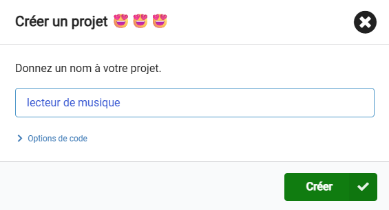
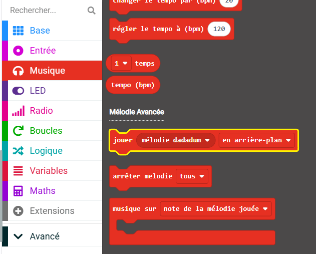
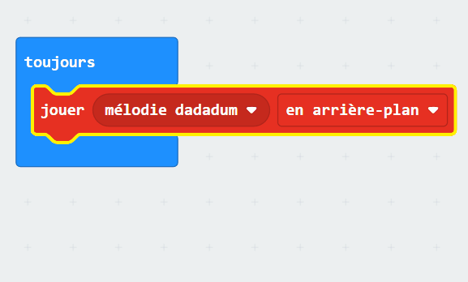
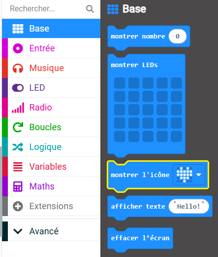
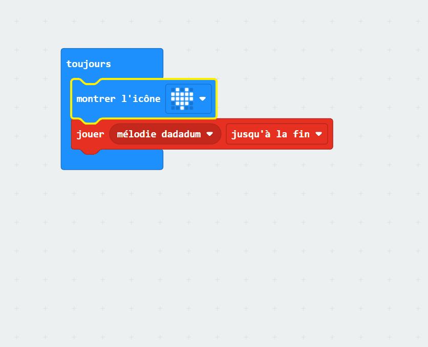

## Jouer une musique

### Ouvrir MakeCode

Pour commencer à créer ton projet micro:bit, tu dois ouvrir l'éditeur MakeCode.

--- task ---

Ouvre l'éditeur MakeCode sur [makecode.microbit.org](https://makecode.microbit.org){:target="_blank"}.

--- collapse ---

---
title: Version hors ligne de l'éditeur
---

Il y a aussi une version [téléchargeable de l'éditeur MakeCode](https://makecode.microbit.org/offline-app){:target="_blank"}.

--- /collapse ---

--- /task ---

### Premier projet sur micro:bit ?

[[[makecode-tour]]]

### Créer ton projet

Une fois que l'éditeur est ouvert, tu devras créer un nouveau projet et lui donner un nom.

--- task ---

Clique sur le bouton **Nouveau projet**.


--- /task ---

--- task ---

Nomme-le `lecteur de musique` et clique sur **Créer**.



**Astuce :** pour faciliter la recherche de ton projet plus tard, donne-lui un nom utile qui se rapporte à l'activité que tu crées.

--- /task ---

### Jouer la musique


Tu vas utiliser le bloc `toujours`{:class="microbitbasic"} pour utiliser la sortie haut-parleur sur le micro:bit (utilisateurs V2 uniquement).

--- collapse ---
---
title: Utilisateurs micro:bit V1
---

La sortie sur haut-parleur n'est disponible que sur le micro:bit V2. Tu devras connecter des écouteurs/haut-parleurs externes pour diffuser du son sur le V1. Tu pourras toujours jouer le son sur le simulateur.

Il y a un guide [pour connecter des écouteurs/haut-parleurs avec le micro:bit V1](https://makecode.microbit.org/projects/hack-your-headphones/make){:target="_blank"}.

--- /collapse ---


--- task ---

Dans le menu `Musique`{:class="microbitmusic"}, fais glisser le bloc `jouer mélodie dadadum`{:class="microbitmusic"} et place-le à l'intérieur du bloc `toujours`{:class="microbitbasic"}.



--- /task ---

--- task ---

Clique sur la flèche vers le bas à côté de `en arrière-plan` sur le bloc `jouer mélodie dadadum`{:class='microbitmusic'}.

Choisis `jusqu'à la fin`.



--- /task ---

### Styliser ta chanson

En plus de jouer une mélodie, tu peux ajouter une image à l'écran LED pour ajouter un peu plus de style !

--- task ---

Ouvre le menu `Base`{:class="microbitbasic"} et trouve le bloc `montrer l'icône`{:class="microbitbasic"}.



--- /task ---

--- task ---

Fais glisser le bloc `montrer l'icône`{:class="microbitbasic"} dans l'éditeur de code.

Place-le à l'intérieur du bloc `toujours`{:class="microbitbasic"} **au-dessus** de ton bloc `mélodie`{:class="microbitmusic"}.

--- /task ---

--- task ---

MakeCode dispose d'icônes préprogrammées qui s'affichent sur l'écran LED.

La valeur par défaut est une icône **cœur**.

**Clique** sur le cœur pour voir les autres options.

**Choisis** une icône qui représente ta mélodie.



Nous avons choisi ce petit canard !

```microbit
basic.forever(function () {
    basic.showIcon(IconNames.Duck)
    music._playDefaultBackground(music.builtInPlayableMelody(Melodies.Dadadadum), music.PlaybackMode.UntilDone)
})
```

--- /task ---

--- task ---

Lorsque tu modifies un bloc de code dans le panneau de l'éditeur de code, le simulateur redémarrera.

**Teste ton programme**

+ Tu devrais maintenant entendre la mélodie jouer jusqu'à la fin (et ensuite en boucle à cause de la boucle toujours)
+ Tu devrais également voir l’icône que tu as choisie affichée sur les LEDs

--- /task ---    

Bravo, tu as créé ton premier programme musical sur un micro:bit !
