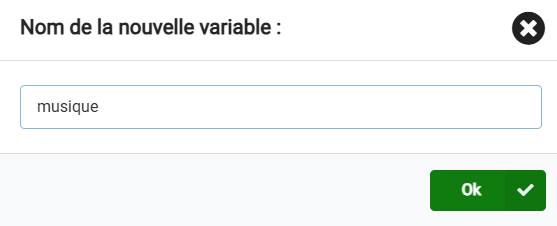
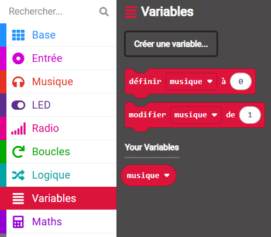
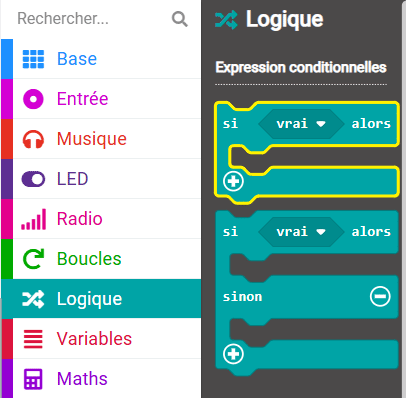
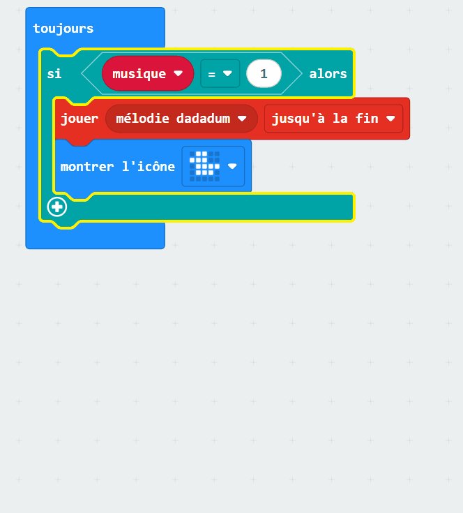
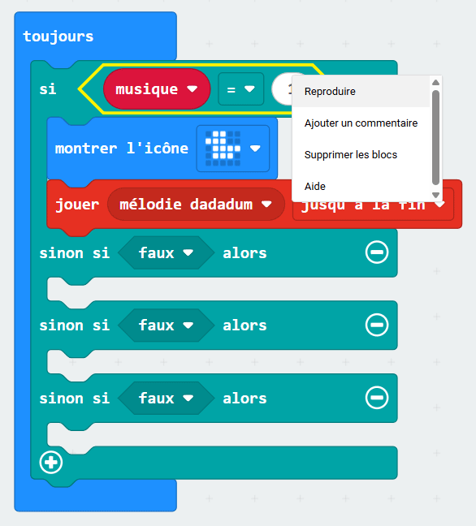
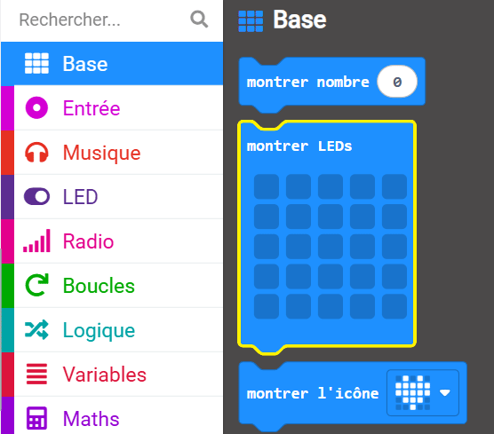
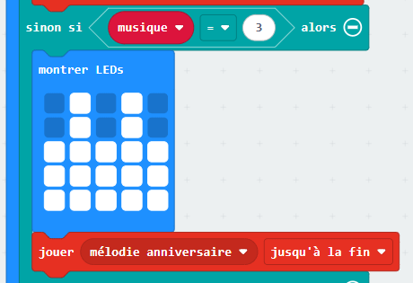

## Autoriser les choix

### Créer une variable

Tout au long du processus de création de ton lecteur de musique, tu devras utiliser des variables.

<p style="border-left: solid; border-width:10px; border-color: #0faeb0; background-color: aliceblue; padding: 10px;">
Qu'est-ce qu'une <span style="color: #0faeb0">variable</span> ?

Une variable est un moyen d'étiqueter et de stocker des données dans tes programmes. Ton programme peut utiliser et modifier les données stockées dans une variable lors de son exécution.

Les données stockées dans une variable peuvent être un nombre comme « 10 » ou un mot comme « dinosaure ».</p>

--- task ---

Ouvre le menu `Variables`{:class="microbitvariables"} et clique sur **Créer une variable**.


--- /task ---

--- task ---

Nomme la nouvelle variable `musique`{:class="microbitvariables"}, puis clique sur le bouton **OK**.



--- /task ---

De nouveaux blocs sont désormais disponibles pour définir, modifier ou utiliser la valeur stockée dans la variable `musique`{:class="microbitvariables"}.



--- task ---

Fais glisser le bloc `définir`{:class="microbitvariables"} et place-le à l'intérieur du bloc `au démarrage`{:class="microbitbasic"}.

Remplace `0` par `1`.

```microbit
let tune = 1
```

--- /task ---

### Utilisation de si...alors

Pour que ton lecteur de musique puisse jouer différents choix de mélodies, tu devras utiliser un bloc logique pour chaque mélodie.

--- task ---

Dans le menu `Logique`{:class="microbitlogic"}, choisis le bloc `si`{:class="microbitlogic"}.



--- /task ---

--- task ---

Place le bloc `si`{:class="microbitlogic"} au-dessus du bloc `montrer l'icône`{:class="microbitbasic"}.

Clique sur le menu `Logique`{:class="microbitlogic"} et fais glisser un bloc de comparaison `0 = 0`{:class="microbitlogic"}.

Place ceci dans la zone `vrai`{:class="microbitlogic"} du bloc `si`{:class="microbitlogic"}.

```microbit
basic.forever(function () {
    if (0 == 0) {

    }
    basic.showIcon(IconNames.Duck)
    music._playDefaultBackground(music.builtInPlayableMelody(Melodies.Dadadadum), music.PlaybackMode.UntilDone)
})
```

--- /task ---

--- task ---

Dans le menu `Variables`{:class="microbitvariables"}, fais glisser un bloc `musique`{:class="microbitvariables"}.

Place-le dans le premier `0` du bloc `0 = 0`{:class="microbitlogic"}.

Remplace le deuxième `0` par `1`.

```microbit
basic.forever(function () {
    let tune = 0
    if (tune == 1) {

    }
    basic.showIcon(IconNames.Duck)
    music._playDefaultBackground(music.builtInPlayableMelody(Melodies.Dadadadum), music.PlaybackMode.UntilDone)
})
```

--- /task ---

--- task ---

Déplace les blocs `montrer l'icône`{:class="microbitbasic"} et `jouer mélodie`{:class="microbitmusic"} à l'intérieur du bloc `si`{:class="microbitlogic"}.

**Astuce :** à chaque fois que tu prends un bloc, tous les blocs au-dessous se déplaceront également, fais simplement glisser le bloc `montrer l'icône`{:class="microbitbasic"} et les autres suivront.

```microbit
basic.forever(function () {
    let tune = 0
    if (tune == 1) {
        basic.showIcon(IconNames.Duck)
        music._playDefaultBackground(music.builtInPlayableMelody(Melodies.Dadadadum), music.PlaybackMode.UntilDone)
    }
})
```

--- /task ---

Pour ajouter plus de choix de mélodie, tu dois créer plus de conditions dans le bloc `si`{:class="microbitlogic"}.

--- task ---

Clique sur le symbole `+` en bas à gauche du bloc `si`{:class="microbitlogic"}. Cela va créer une section `sinon`{:class="microbitlogic"}.

--- /task ---

--- task ---

Clique sur le symbole `+` sous la section `sinon`{:class="microbitlogic"}.

Cela va créer une section `sinon si`{:class="microbitlogic"}.

Répète cette opération deux fois, de manière à obtenir trois sections `sinon si`{:class="microbitlogic"} et une section `sinon`{:class="microbitlogic"}.

--- /task ---

--- task ---

Clique sur le symbole `-` à côté de la section `sinon`{:class="microbitlogic"} pour supprimer la section `sinon`{:class="microbitlogic"}.



--- /task ---

--- task ---

Fais un clic droit sur le bloc `musique`{:class="microbitvariables"} `=`{:class="microbitlogic"} `1` et duplique-le.



--- /task ---

--- task ---

Place le bloc `musique`{:class="microbitvariables"} `=`{:class="microbitlogic"} `1` entre le premier bloc `sinon si`{:class="microbitlogic"} et `alors`{:class="microbitlogic"}.

Duplique deux blocs de comparaison supplémentaires et place-les entre les autres parties `si`{:class="microbitlogic"} et `alors`{:class="microbitlogic"}.

```microbit
basic.forever(function () {
    let tune = 0
    if (tune == 1) {
        basic.showIcon(IconNames.Duck)
        music._playDefaultBackground(music.builtInPlayableMelody(Melodies.Dadadadum), music.PlaybackMode.UntilDone)
    } else if (tune == 1) {

    } else if (tune == 1) {

    } else if (tune == 1) {

    }
})
```

--- /task ---

--- task ---

À l'intérieur de la première section `sinon si`{:class="microbitlogic"}, remplace `1` par `2`.

Pour la deuxième section `sinon si`{:class="microbitlogic"}, remplace `1` par `3`.

Pour la troisième section `sinon si`{:class="microbitlogic"}, remplace `1` par `4`.

```microbit
basic.forever(function () {
    let tune = 0
    if (tune == 1) {
        basic.showIcon(IconNames.Duck)
        music._playDefaultBackground(music.builtInPlayableMelody(Melodies.Dadadadum), music.PlaybackMode.UntilDone)
    } else if (tune == 2) {

    } else if (tune == 3) {

    } else if (tune == 4) {

    }
})
```

--- /task ---

Tu dois maintenant sélectionner une mélodie différente pour chaque section `sinon si`{:class="microbitlogic"}.

Chaque fois que la valeur de la variable est modifiée, une mélodie différente sera jouée.

--- task ---

Duplique le bloc `jouer mélodie dadadum`{:class="microbitmusic"}.

Place le bloc dupliqué à l'intérieur de la première section `sinon si`{:class="microbitlogic"}.

Clique sur la flèche à côté de `mélodie dadadum`{:class="microbitmusic"} pour voir d'autres options.

Fais défiler pour voir toutes les mélodies et choisis-en une.

Répète ces étapes pour les deuxième et troisième sections `sinon si`{:class="microbitlogic"}.

Tu devrais maintenant avoir quatre mélodies, une pour chacune des quatre conditions.

```microbit
basic.forever(function () {
    let tune = 0
    if (tune == 1) {
        music._playDefaultBackground(music.builtInPlayableMelody(Melodies.Dadadadum), music.PlaybackMode.UntilDone)
        basic.showIcon(IconNames.Duck)
    } else if (tune == 2) {
        music._playDefaultBackground(music.builtInPlayableMelody(Melodies.Punchline), music.PlaybackMode.UntilDone)
    } else if (tune == 3) {
        music._playDefaultBackground(music.builtInPlayableMelody(Melodies.Birthday), music.PlaybackMode.UntilDone)
    } else if (tune == 4) {
        music._playDefaultBackground(music.builtInPlayableMelody(Melodies.Baddy), music.PlaybackMode.UntilDone)
    }
})
```

--- /task ---

Tu dois aussi sélectionner quelques **icônes** pour chacune de tes nouvelles chansons.

Tu peux dupliquer le bloc `montrer l'icône`{:class="microbitbasic"}.

Tu peux aussi utiliser le bloc `montrer LEDs`{:class="microbitbasic"} pour dessiner le tien !

--- collapse ---

---
title: Le bloc monter LEDs
---

À l'intérieur du menu `Base`{:class="microbitbasic"}, trouve le bloc `montrer LEDs`{:class="microbitbasic"} et fais-le glisser à l'intérieur d'un `sinon si`{:class="microbitlogic"} pour l'utiliser.



Tu peux cliquer sur chacun des carrés pour dessiner ton image. Des carrés blancs seront allumés sur le micro:bit.

Nous avons dessiné un **gâteau d'anniversaire** pour la mélodie `anniversaire`.



--- /collapse ---

--- task ---

Ajoute des icônes pour chacune de tes chansons en utilisant le bloc `montrer l'icône`{:class="microbitbasic"} ou `montrer LEDs`{:class="microbitbasic"}.

```microbit
basic.forever(function () {
    let tune = 0
    if (tune == 1) {
        basic.showIcon(IconNames.Duck)
        music._playDefaultBackground(music.builtInPlayableMelody(Melodies.Dadadadum), music.PlaybackMode.UntilDone)
    } else if (tune == 2) {
        basic.showIcon(IconNames.Silly)
        music._playDefaultBackground(music.builtInPlayableMelody(Melodies.Punchline), music.PlaybackMode.UntilDone)
    } else if (tune == 3) {
        basic.showLeds(`
            . # . # .
            . # . # .
            # # # # #
            # # # # #
            # # # # #
            `)
        music._playDefaultBackground(music.builtInPlayableMelody(Melodies.Birthday), music.PlaybackMode.UntilDone)
    } else if (tune == 4) {
        basic.showIcon(IconNames.Skull)
        music._playDefaultBackground(music.builtInPlayableMelody(Melodies.Baddy), music.PlaybackMode.UntilDone)
    }
})
```

--- /task ---

--- task ---

**Débogage :** assure-toi d'avoir modifié tous les nombres dans les comparaisons après les avoir dupliqués.

Tu devrais avoir `1` dans la section `si`{:class="microbitlogic"} puis `2, 3, 4` dans les sections `sinon si`{:class="microbitlogic"}.

--- /task ---

--- task ---

Lorsque tu modifies un bloc de code dans le panneau de l'éditeur de code, le simulateur redémarrera.

**Teste ton programme**

+ Modifie le `définir musique`{:class="microbitvariables"} de `1` à `2` sur le bloc `au démarrage`{:class="microbitbasic"}. Le simulateur redémarrera et jouera la mélodie pendant 2 minutes, puis montrera cette icône.

+ Répète les mêmes étapes pour les mélodies 3 et 4.

+ Veille à remettre le `définir musique`{:class="microbitvariables"} à `1` à la fin de tes tests.

Bravo, tu as choisi différentes mélodies pour ton lecteur de musique !

--- /task ---
