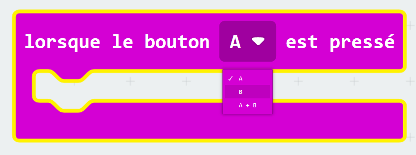
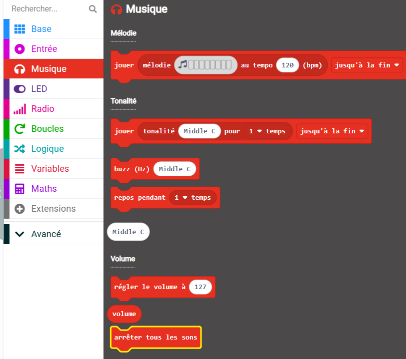
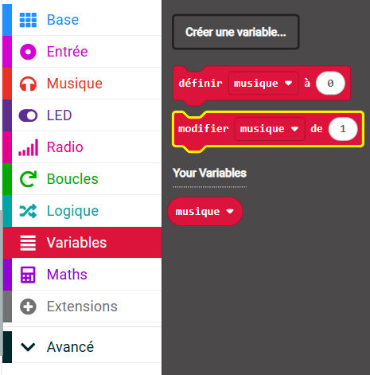

## Utiliser les boutons pour passer les musiques

Au lieu de changer la mélodie en changeant la valeur de la variable `musique` dans le bloc `au démarrage`, tu peux utiliser des boutons pour changer la valeur (et donc la mélodie).

Dans cette étape, tu vas créer du code pour passer des pistes en utilisant les gestionnaires d'événements du micro:bit.

<p style="border-left: solid; border-width:10px; border-color: #0faeb0; background-color: aliceblue; padding: 10px;">
Qu'est-ce qu'un <span style="color: #0faeb0">gestionnaire d'événements</span> ?

Un gestionnaire d'événements est un code qui s'exécutera lorsqu'un événement particulier se produit, tel que « le bouton A est pressé ».

</p>

### Ajouter des boutons de contrôle

Le micro:bit possède un bouton `A` et un bouton `B`.

Tu peux utiliser un événement pour déterminer ce qui se passe lorsque tu appuies sur un bouton.

### Passer à la piste suivante

Le bouton B se trouve à droite du micro:bit, utilise donc ce bouton pour passer à la piste suivante.

Pour cela, tu dois modifier la valeur de la variable `musique`{:class="microbitvariables"} par `1`.

--- task ---

Dans le menu `Entrée`{:class="microbitinput"}, fais glisser le bloc `lorsque le bouton`{:class="microbitinput"} vers le panneau de l'éditeur de code.


--- /task ---

--- task ---

Clique sur la flèche à côté de `A`{:class="microbitinput"} sur le bloc `lorsque le bouton`{:class="microbitinput"}.

Remplace le `A`{:class="microbitinput"} par `B`{:class="microbitinput"}



--- /task ---

#### Arrêter tous les sons !

Maintenant, tu dois arrêter la musique en cours.

--- task ---

Dans le menu `Musique`{:class="microbitmusic"}, fais glisser le bloc `arrêter tous les sons`{:class="microbitmusic"}.

Place-le dans le bloc `lorsque le bouton [B]`{:class="microbitinput"} dans le panneau de l'éditeur de code.



```microbit
input.onButtonPressed(Button.B, function () {
    music.stopAllSounds()
})
```

--- /task ---

--- task ---

Dans le menu `Variables`{:class="microbitvariables"}, fais glisser le bloc `modifier`{:class="microbitvariables"}.

Place-le sous le bloc `arrêter tous les sons`{:class="microbitmusic"}.



```microbit
let musique = 0
input.onButtonPressed(Button.B, function () {
    music.stopAllSounds()
    musique += 1
})
```

--- /task ---

#### Gérer les « out of range »

Si la valeur de la variable est `4`, la modifier par `1` rendra la valeur `5`.

🚨 Mais il n'y a pas de mélodie associée à la valeur `5`! 🚨

Parce que tu n'as que quatre mélodies, si la variable passe à 5, tu dois revenir à la première mélodie.

```microbit
basic.forever(function () {
    let musique = 0
    if (musique == 1) {
        basic.showIcon(IconNames.Duck)
        music._playDefaultBackground(music.builtInPlayableMelody(Melodies.Dadadadum), music.PlaybackMode.UntilDone)
    } else if (musique == 2) {
        basic.showIcon(IconNames.Silly)
        music._playDefaultBackground(music.builtInPlayableMelody(Melodies.Punchline), music.PlaybackMode.UntilDone)
    } else if (musique == 3) {
        basic.showLeds(`
            . # . # .
            . # . # .
            # # # # #
            # # # # #
            # # # # #
            `)
        music._playDefaultBackground(music.builtInPlayableMelody(Melodies.Birthday), music.PlaybackMode.UntilDone)
    } else if (musique == 4) {
        basic.showIcon(IconNames.Skull)
        music._playDefaultBackground(music.builtInPlayableMelody(Melodies.Baddy), music.PlaybackMode.UntilDone)
    }
})
```

--- task ---

Dans le menu `Logique`{:class="microbitlogic"}, fais glisser le bloc `si`{:class="microbitlogic"}.

Place-le sous le bloc `modifier musique`{:class="microbitvariables"} dans ton code.

```microbit
let musique = 0
input.onButtonPressed(Button.B, function () {
    music.stopAllSounds()
    musique += 1
    if (true) {

    }
})
```

--- /task ---

--- task ---

Également dans le menu `Logique`{:class="microbitlogic"}, fais glisser un bloc `0 < 0`{:class="microbitlogic"}.

Place-le à l'intérieur de la partie `vrai` du bloc `si`{:class="microbitlogic"}.

Modifie le `<` (inférieur à) par `>` (supérieur) en cliquant sur la flèche à côté du symbole `<`.

```microbit
let musique = 0
input.onButtonPressed(Button.B, function () {
    music.stopAllSounds()
    musique += 1
    if (0 > 0) {

    }
})
```

--- /task ---

--- task ---

Dans le menu `Variables`{:class="microbitvariables"}, fais glisser le bloc variable `musique`{:class="microbitvariables"}.

Place-le sur le premier bloc `0` dans le `0 > 0`{:class="microbitlogic"}.

```microbit
let musique = 0
input.onButtonPressed(Button.B, function () {
    music.stopAllSounds()
    musique += 1
    if (musique > 0) {

    }
})
```

Modifie le deuxième `0` par `4`.

```microbit
let musique = 0
input.onButtonPressed(Button.B, function () {
    music.stopAllSounds()
    musique += 1
    if (musique > 4) {

    }
})
```

--- /task ---

--- task ---

Dans le menu `Variables`{:class="microbitvariables"}, fais glisser le bloc `définir`{:class="microbitvariables"}.

Place-le à l'intérieur du bloc `si`{:class="microbitlogic"} dans ton code.

Modifie le `0` par `1`.

```microbit
let musique = 0
input.onButtonPressed(Button.B, function () {
    music.stopAllSounds()
    musique += 1
    if (musique > 4) {
        musique = 1
    }
})
```

--- /task ---


#### Passer à la piste précédente

Le bouton A est à gauche du micro:bit, alors utilise ce bouton pour passer à la piste précédente.

Pour cela, tu dois modifier la valeur de la variable `musique`{:class="microbitvariables"} par `-1`.

Tu peux réutiliser le code que tu as créé pour contrôler ce qui se passe lorsque le bouton B est pressé.

--- task ---

**Fais un clic droit** sur la partie supérieure du bloc `lorsque le bouton B est pressé`{:class="microbitinput"} que tu as maintenant dans le panneau de l'éditeur de code.

Clique sur **Reproduire** pour faire une copie de l'ensemble du bloc.

Tu devrais maintenant avoir un deuxième bloc `lorsque le bouton est pressé`{:class="microbitinput"} qui est « grisé ».

Modifie le bouton de `B` par `A`. Cela empêchera le bloc d'être grisé.

```microbit
let musique = 0
input.onButtonPressed(Button.A, function () {
    music.stopAllSounds()
    musique += 1
    if (musique > 4) {
        musique = 1
    }
})
input.onButtonPressed(Button.B, function () {
    music.stopAllSounds()
    musique += 1
    if (musique > 4) {
        musique = 1
    }
})
```

--- /task ---

--- task ---
Effectue ces modifications au bloc `lorsque le bouton A est pressé`{:class="microbitinput"} :

Modifie le bloc `1` par `-1` dans le bloc `modifier`{:class="microbitvariables"}.

Dans le bloc de comparaison :

+ Modifie le `>` par `<`

+ Modifie le `4` par `1`

Modifie le bloc `1` par `4` dans le bloc `définir`{:class="microbitvariables"}.

--- /task ---


Tu devrais maintenant avoir un bloc de code `lorsque le bouton A est pressé`{:class="microbitinput"} et un bloc de code `lorsque le bouton B est pressé`{:class="microbitinput"} :

```microbit
let musique = 0
input.onButtonPressed(Button.A, function () {
    music.stopAllSounds()
    musique += -1
    if (musique < 1) {
        musique = 4
    }
})
input.onButtonPressed(Button.B, function () {
    music.stopAllSounds()
    musique += 1
    if (musique > 4) {
        musique = 1
    }
})
```

--- task ---

**Débogage :** assure-toi d'avoir modifié les valeurs correctes dans les blocs utilisés pour modifier la valeur des variables.

Par exemple : `Bouton A` doit modifier la variable par `-1` et le Bouton B doit modifier la valeur de la variable par `1`.

--- /task ---

--- task ---

Lorsque tu modifies un bloc de code dans le panneau de l'éditeur de code, le simulateur redémarrera.

**Teste ton programme**

+ Appuie sur le bouton A pour passer à la piste précédente

+ Appuie sur le bouton B pour passer à la piste suivante

--- /task ---


Bravo, tu peux maintenant passer tes pistes d'avant en arrière !
