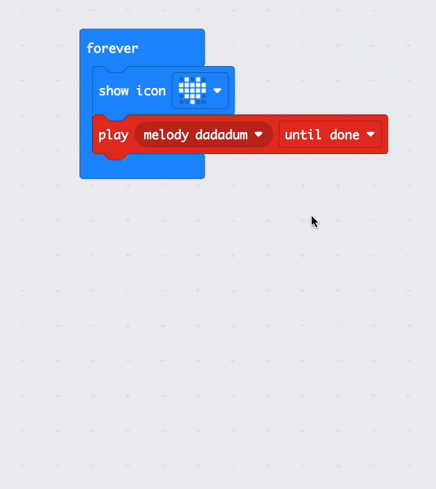

## 曲を再生

### MakeCodeを開く

micro:bit プロジェクトの作成を開始するには、MakeCode エディターを開く必要があります。

--- task ---

[makecode.microbit.org](https://makecode.microbit.org){:target="_blank"} で MakeCode エディターを開きます。

--- collapse ---

---
title: エディタのオフラインバージョン
---

[MakeCode エディターのダウンロード可能なバージョン](https://makecode.microbit.org/offline-app){:target="_blank"}もあります。

--- /collapse ---

--- /task ---

### 最初の micro:bit プロジェクトですか?

[[[makecode-tour]]]

### プロジェクトを作成する

エディターが開いたら、新しいプロジェクトを作成し、プロジェクトに名前を付ける必要があります。

--- task ---

**新しいプロジェクト** ボタンをクリックします。


--- /task ---

--- task ---

新しいプロジェクトに「 `音楽プレーヤー` 」という名前を付け、「 **作成**」をクリックします。


**ヒント:** 後でプロジェクトを見つけやすくするために、作成しているものに関連するわかりやすい名前を付けましょう。

--- /task ---

### メロディーを演奏する


`ずっと`{:class="microbitbasic"}ブロックを使ってmicro:bitのスピーカー出力を利用します(V2ユーザーのみ)。

--- collapse ---
---
title: V1 micro:bit ユーザー
---

スピーカー出力は V2 micro:bit でのみ利用可能です。 V1 でサウンドを再生するには、外部のヘッドフォン/スピーカーを接続する必要があります。 シミュレーターでサウンドを再生することは可能です。

[V1 micro:bit にヘッドフォン/スピーカーを接続するための ガイド](https://makecode.microbit.org/projects/hack-your-headphones/make){:target="_blank"}があります。

--- /collapse ---


--- task ---

`音楽`{:class="microbitmusic"} メニューから、 `鳴らす メロディ ダダダム`{:class="microbitmusic"} ブロックをドラッグし、 `ずっと`{:class="microbitbasic"} ブロック内に配置します。


--- /task ---

--- task ---

`鳴らす メロディ ダダダム`{:class='microbitmusic'} ブロックの`バックグラウンドで一度だけ`の横にある下矢印をクリックします。

`終わるまで`を選択します。


--- /task ---

### 曲のスタイルを決める

メロディーを演奏するだけでなく、LED ディスプレイに画像を追加して、さらにスタイリッシュに演出できます。

--- task ---

`基本`{:class="microbitbasic"} メニューを開き、 `アイコンを表示`{:class="microbitbasic"} ブロックを見つけます。


--- /task ---

--- task ---

`アイコンを表示`{:class="microbitbasic"} ブロックをコード エディターにドラッグします。

あなたの `鳴らす`{:class="microbitmusic"} ブロックの **上** にある `ずっと`{:class="microbitbasic"} ブロックの中にそれを配置します。

--- /task ---

--- task ---

MakeCodeは、LEDパネルに表示する事前にプログラムされたアイコンがあります。

デフォルトは **ハート** アイコンです。

他のオプションを表示するには、ハートを**クリック**します。

あなたのメロディーを表すアイコンを**選択**します。



私たちはこの小さなアヒルを選びました！

```microbit
basic.forever(function () {
    basic.showIcon(IconNames.Duck)
    music._playDefaultBackground(music.builtInPlayableMelody(Melodies.Dadadadum), music.PlaybackMode.UntilDone)
})
```

--- /task ---

--- task ---

コード エディター パネルでコード ブロックを変更すると、シミュレーターが再起動します。

**プログラムを試してみましょう。**

+ メロディーが終わるまで再生されるはずです(その後、ずっとループのおかげでループし続けます)。
+ また、選択したアイコンがLEDに表示されるはずです。

--- /task ---    

よくできました。micro:bit で最初の音楽プログラムを作成しました。
