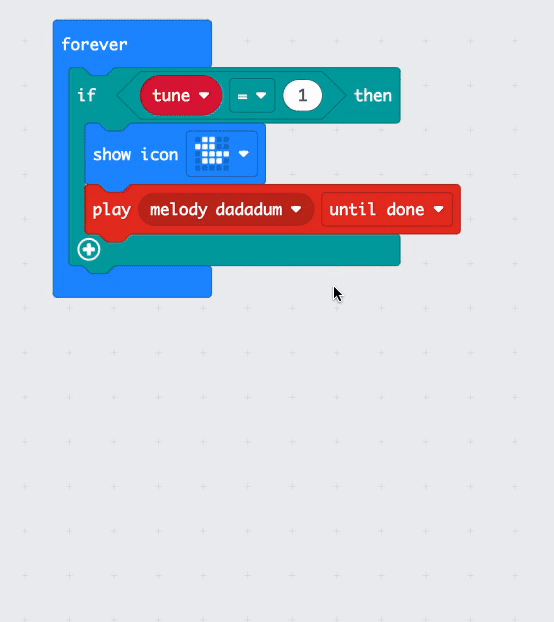

## 選択を可能にする

### 変数を作成する

音楽プレーヤーの作成作業全体を通して、変数を使用する必要があります。

<p style="border-left: solid; border-width:10px; border-color: #0faeb0; background-color: aliceblue; padding: 10px;">
<span style="color: #0faeb0">変数</span>とは何ですか?

変数は、プログラム内でデータにラベルを付けて保存する方法です。 プログラムは、実行時に変数に保存されているデータを使用し、変更することができます。

変数に格納されているデータは、`10`のような数字だったり、`恐竜`のような単語であるかもしれません。</p>

--- task ---

`変数`{:class="microbitvariables"} メニューを開き、 **変数を追加する**をクリックします。


--- /task ---

--- task ---

新しい変数に `tune`{:class="microbitvariables"} という名前を付け、 **OK** ボタンをクリックします。


--- /task ---

新しいブロックが利用できるようになり、設定や変更を行うことができます。 または、 変数`tune`{:class="microbitvariables"}に格納されている値を使用できます。


--- task ---

`変数を〜に設定する`{:class="microbitvariables"}ブロックをドラッグして、 `最初だけ`{:class="microbitbasic"}ブロック内に配置します。

`0` を `1`に変更します。

```microbit
let tune = 1
```

--- /task ---

### もし...ならの使用

音楽プレーヤーでさまざまなメロディーの選択肢を再生するには、メロディーごとに論理 ブロックを使用する必要があります。

--- task ---

`論理`{:class="microbitlogic"} メニューから、 `もし`{:class="microbitlogic"} ブロックを選択します。


--- /task ---

--- task ---

`もし`{:class="microbitlogic"} ブロックを `アイコンを表示`{:class="microbitbasic"} ブロックの上に配置します。

`論理`{:class="microbitlogic"} メニューをクリックし、くらべるの `0 = 0`{:class="microbitlogic"} ブロックをドラッグします。

これを、 `もし`{:class="microbitlogic"} ブロックの `真`{:class="microbitlogic"} 領域に配置します。

```microbit
basic.forever(function () {
    if (0 == 0) {

    }
    basic.showIcon(IconNames.Duck)
    music._playDefaultBackground(music.builtInPlayableMelody(Melodies.Dadadadum), music.PlaybackMode.UntilDone)
})
```

--- /task ---

--- task ---

`変数`{:class="microbitvariables"} メニューから、 `tune`{:class="microbitvariables"} ブロックをドラッグします。

それを `0 = 0`{:class="microbitlogic"} ブロックの最初の `0` に配置します。

2番目の `0` を `1`に変更します。

```microbit
basic.forever(function () {
    let tune = 0
    if (tune == 1) {

    }
    basic.showIcon(IconNames.Duck)
    music._playDefaultBackground(music.builtInPlayableMelody(Melodies.Dadadadum), music.PlaybackMode.UntilDone)
})
```

--- /task ---

--- task ---

`アイコンを表示`{:class="microbitbasic"} ブロックと `鳴らす メロディ`{:class="microbitmusic"} ブロックを `もし`{:class="microbitlogic"} ブロック内に移動します。

**ヒント:** ブロックをつかむと、その下にあるすべてのブロックも移動するので、 `アイコンを表示`{:class="microbitbasic"} ブロックをドラッグしたら、他のブロックもついてきます。

```microbit
basic.forever(function () {
    let tune = 0
    if (tune == 1) {
        basic.showIcon(IconNames.Duck)
        music._playDefaultBackground(music.builtInPlayableMelody(Melodies.Dadadadum), music.PlaybackMode.UntilDone)
    }
})
```

--- /task ---

メロディーの選択肢をさらに追加するには、 `もし`{:class="microbitlogic"} 
ブロックにさらに条件を作成する必要があります。

--- task ---

`もし`{:class="microbitlogic"} ブロックの左下にある `+` シンボルをクリックします。 これにより、 `でなければ`{:class="microbitlogic"} セクションが作成されます。

--- /task ---

--- task ---

`でなければ`{:class="microbitlogic"} セクションの下にある `+` シンボルをクリックします。

これにより、 `でなければもし`{:class="microbitlogic"} セクションが作成されます。

これを 2 回繰り返すと、3 つの `でなければもし`{:class="microbitlogic"} セクションと 1 つの `でなければ`{:class="microbitlogic"} セクションが作成されます。

--- /task ---

--- task ---

`でなければ`{:class="microbitlogic"} セクションの横にある `-` シンボルをクリックして、 `でなければ`{:class="microbitlogic"} セクションを取り除きます。



--- /task ---

--- task ---

`tune`{:class="microbitvariables"} `=`{:class="microbitlogic"} `1` ブロックを右クリックして複製します。


--- /task ---

--- task ---

複製された `tune`{:class="microbitvariables"} `=`{:class="microbitlogic"} `1` ブロックを最初の `でなければ`{:class="microbitlogic"} と `なら`{:class="microbitlogic"} の間に配置します。

さらに 2 つの比較ブロックを複製し、他の `でなければもし`{:class="microbitlogic"} と `なら`{:class="microbitlogic"} の部分の間に配置します。

```microbit
basic.forever(function () {
    let tune = 0
    if (tune == 1) {
        basic.showIcon(IconNames.Duck)
        music._playDefaultBackground(music.builtInPlayableMelody(Melodies.Dadadadum), music.PlaybackMode.UntilDone)
    } else if (tune == 1) {

    } else if (tune == 1) {

    } else if (tune == 1) {

    }
})
```

--- /task ---

--- task ---

最初の `でなければもし`{:class="microbitlogic"} セクションで、 `1` を `2`に変更します。

2 番目の `でなければもし`{:class="microbitlogic"} セクションで、 `1` を `3`に変更します。

3 番目の `でなければもし`{:class="microbitlogic"} セクションで、 `1` を `4`に変更します。

```microbit
basic.forever(function () {
    let tune = 0
    if (tune == 1) {
        basic.showIcon(IconNames.Duck)
        music._playDefaultBackground(music.builtInPlayableMelody(Melodies.Dadadadum), music.PlaybackMode.UntilDone)
    } else if (tune == 2) {

    } else if (tune == 3) {

    } else if (tune == 4) {

    }
})
```

--- /task ---

ここで、各 `でなければもし`{:class="microbitlogic"} セクションごとに異なるメロディーを選択する必要があります。

変数の値が変更されるたびに、異なるメロディーが再生されます。

--- task ---

`鳴らす メロディ ダダダム`{:class="microbitmusic"} ブロックを複製します。

複製したブロックを最初の `でなければもし`{:class="microbitlogic"} セクション内に配置します。

その他のメロディー オプションを表示するには、 `メロディ ダダダム`{:class="microbitmusic"} の横にある矢印をクリックします。

スクロールしてすべてのメロディーを表示し、いずれかを選択します。

2 番目と 3 番目の `でなければもし`{:class="microbitlogic"} セクションでもこれらの手順を繰り返します。

これで、4 つの条件ごとに 1 つずつ、計 4 つのメロディーができたはずです。

```microbit
basic.forever(function () {
    let tune = 0
    if (tune == 1) {
        music._playDefaultBackground(music.builtInPlayableMelody(Melodies.Dadadadum), music.PlaybackMode.UntilDone)
        basic.showIcon(IconNames.Duck)
    } else if (tune == 2) {
        music._playDefaultBackground(music.builtInPlayableMelody(Melodies.Punchline), music.PlaybackMode.UntilDone)
    } else if (tune == 3) {
        music._playDefaultBackground(music.builtInPlayableMelody(Melodies.Birthday), music.PlaybackMode.UntilDone)
    } else if (tune == 4) {
        music._playDefaultBackground(music.builtInPlayableMelody(Melodies.Baddy), music.PlaybackMode.UntilDone)
    }
})
```

--- /task ---

また、新しい曲ごとに **アイコン** を選択する必要があります。

`アイコンを表示`{:class="microbitbasic"} ブロックを複製できます。

`LED画面に表示`{:class="microbitbasic"} ブロックを使用して独自のものを描画することもできます。

--- collapse ---

---
title: LED画面に表示ブロック
---

`基本`{:class="microbitbasic"} メニュー内で、 `LED画面に表示`{:class="microbitbasic"} ブロックを見つけて、 `でなければもし`{:class="microbitlogic"} 内にドラッグして使用します。


それぞれの四角形をクリックすると絵が描けます。 micro:bitでは白い四角形が点灯します。

`ハッピーバースデー` メロディーのために **誕生日ケーキ** を描きました。


--- /collapse ---

--- task ---

`アイコンを表示`{:class="microbitbasic"} または `LED画面に表示`{:class="microbitbasic"} ブロックを使用して、各曲のアイコンを追加します。

```microbit
basic.forever(function () {
    let tune = 0
    if (tune == 1) {
        basic.showIcon(IconNames.Duck)
        music._playDefaultBackground(music.builtInPlayableMelody(Melodies.Dadadadum), music.PlaybackMode.UntilDone)
    } else if (tune == 2) {
        basic.showIcon(IconNames.Silly)
        music._playDefaultBackground(music.builtInPlayableMelody(Melodies.Punchline), music.PlaybackMode.UntilDone)
    } else if (tune == 3) {
        basic.showLeds(`
            . # . # .
            . # . # .
            # # # # #
            # # # # #
            # # # # #
            `)
        music._playDefaultBackground(music.builtInPlayableMelody(Melodies.Birthday), music.PlaybackMode.UntilDone)
    } else if (tune == 4) {
        basic.showIcon(IconNames.Skull)
        music._playDefaultBackground(music.builtInPlayableMelody(Melodies.Baddy), music.PlaybackMode.UntilDone)
    }
})
```

--- /task ---

--- task ---

**デバッグ:** くらべるを複製した後、すべての数値が変更されていることを確認します。

`もし`{:class="microbitlogic"} セクションに `1` があり、 `でなければもし`{:class="microbitlogic"} セクションに `2, 3, 4` があるはずです。

--- /task ---

--- task ---

コード エディター パネルでコード ブロックを変更すると、シミュレーターが再起動します。

**プログラムを試してみましょう。**

+ `最初だけ`{:class="microbitbasic"} ブロックの、 `変数tune`{:class="microbitvariables"} を `1` から `2` に変更します。 シミュレータは再起動し、2のメロディを再生し、そのアイコンを表示します。

+ メロディー3と4についても同じ手順を繰り返します。

+ テストの最後に、 `変数tune`{:class="microbitvariables"} を `1` に戻してください。

よくできました。音楽プレーヤーにさまざまなメロディーを選択しました！

--- /task ---
