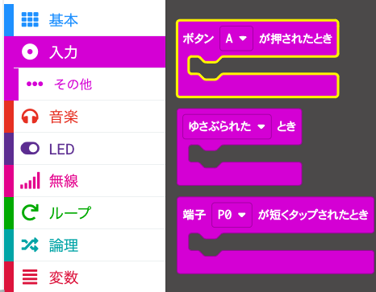
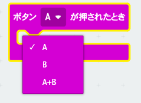
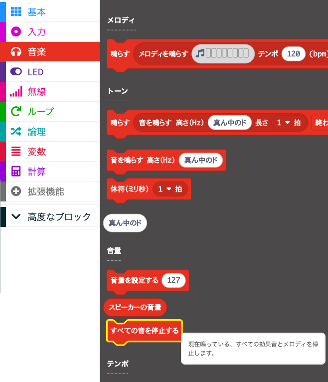
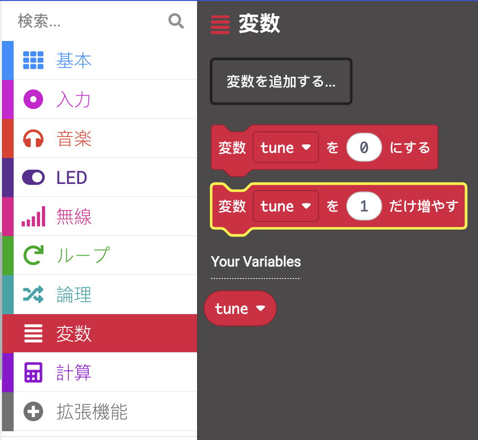

## ボタンを使用して曲をスキップ

`最初だけ` ブロック内の `tune` 変数値を変更してメロディーを変更する代わりに、ボタンを使用して値 (およびメロディー) を変更できます。

このステップでは、micro:bit のイベント ハンドラーを使用してトラックをスキップするコードを作成します。

<p style="border-left: solid; border-width:10px; border-color: #0faeb0; background-color: aliceblue; padding: 10px;">
<span style="color: #0faeb0">イベント ハンドラー</span>とは何ですか?

イベント ハンドラーは、「ボタン A が押された」などの特定のイベントが発生したときに実行されるコードです。

</p>

### ボタンコントロールを追加する

micro:bit には、ボタン `A` とボタン `B`があります。

イベントを使用して、ボタンが押されたときに何が起こるかを制御できます。

### 次のトラックへスキップ

ボタン B は micro:bit の右側にあるので、このボタンを使用して次のトラックにスキップします。

これを行うには、 `tune`{:class="microbitvariables"} の変数の値を `1`ずつ変更する必要があります。

--- task ---

`入力`{:class="microbitinput"} メニューから、 `ボタン`{:class="microbitinput"} ブロックをコード エディター パネルにドラッグします。



--- /task ---

--- task ---

`ボタン`{:class="microbitinput"} ブロックの `A`{:class="microbitinput"} の横にある矢印をクリックします。

`A`{:class="microbitinput"} を `B`{:class="microbitinput"} に変更します。



--- /task ---

#### すべての音を停止

現在の曲を停止する必要があります。

--- task ---

`音楽`{:class="microbitmusic"} メニューから、 `すべての音を停止する`{:class="microbitmusic"} ブロックをドラッグします。

コード エディター パネルの`ボタン [B]`{:class="microbitinput"} ブロックの中に配置します。



```microbit
input.onButtonPressed(Button.B, function () {
    music.stopAllSounds()
})
```

--- /task ---

--- task ---

`変数`{:class="microbitvariables"} メニューから、 `変数を〜だけ増やす`{:class="microbitvariables"} ブロックをドラッグします。

`すべての音を停止する`{:class="microbitmusic"} ブロックの下に配置します。



```microbit
let tune = 0
input.onButtonPressed(Button.B, function () {
    music.stopAllSounds()
    tune += 1
})
```

--- /task ---

#### 「範囲外」への対処

変数の値が `4`の場合、それを `1` 増やすと、値は `5`になります。

🚨 しかし、値 `5`に関連付けられたメロディーはありません。 🚨

メロディーは 4 つしかないため、変数が 5 に変わった場合は、最初のメロディーに戻る必要があります。

```microbit
basic.forever(function () {
    let tune = 0
    if (tune == 1) {
        basic.showIcon(IconNames.Duck)
        music._playDefaultBackground(music.builtInPlayableMelody(Melodies.Dadadadum), music.PlaybackMode.UntilDone)
    } else if (tune == 2) {
        basic.showIcon(IconNames.Silly)
        music._playDefaultBackground(music.builtInPlayableMelody(Melodies.Punchline), music.PlaybackMode.UntilDone)
    } else if (tune == 3) {
        basic.showLeds(`
            . # . # .
            . # . # .
            # # # # #
            # # # # #
            # # # # #
            `)
        music._playDefaultBackground(music.builtInPlayableMelody(Melodies.Birthday), music.PlaybackMode.UntilDone)
    } else if (tune == 4) {
        basic.showIcon(IconNames.Skull)
        music._playDefaultBackground(music.builtInPlayableMelody(Melodies.Baddy), music.PlaybackMode.UntilDone)
    }
})
```

--- task ---

`論理`{:class="microbitlogic"} メニューから、 `もし`{:class="microbitlogic"} ブロックをドラッグします。

コード内の `変数を〜だけ増やす`{:class="microbitvariables"} ブロックの下に配置します。

```microbit
let tune = 0
input.onButtonPressed(Button.B, function () {
    music.stopAllSounds()
    tune += 1
    if (true) {

    }
})
```

--- /task ---

--- task ---

また、`論理`{:class="microbitlogic"}メニューから、 `0 < 0`{:class="microbitlogic"} ブロックをドラッグします。

それを `もし`{:class="microbitlogic"} ブロックの `真` 部分内に配置します。

`<` 記号の横にある矢印をクリックして、 `<` (より小さい) を `>` (より大きい) に変更します。

```microbit
let tune = 0
input.onButtonPressed(Button.B, function () {
    music.stopAllSounds()
    tune += 1
    if (0 > 0) {

    }
})
```

--- /task ---

--- task ---

`変数`{:class="microbitvariables"} メニューから、 `tune`{:class="microbitvariables"} 変数ブロックをドラッグします。

それを `0 > 0`{:class="microbitlogic"} ブロックの最初の `0` に配置します。

```microbit
let tune = 0
input.onButtonPressed(Button.B, function () {
    music.stopAllSounds()
    tune += 1
    if (tune > 0) {

    }
})
```

2番目の `0` を `4`に変更します。

```microbit
let tune = 0
input.onButtonPressed(Button.B, function () {
    music.stopAllSounds()
    tune += 1
    if (tune > 4) {

    }
})
```

--- /task ---

--- task ---

`変数`{:class="microbitvariables"} メニューから、 `変数を〜にする`{:class="microbitvariables"} ブロックをドラッグします。

コード内の `もし`{:class="microbitlogic"} ブロック内に配置します。

`0` を `1`に変更します。

```microbit
let tune = 0
input.onButtonPressed(Button.B, function () {
    music.stopAllSounds()
    tune += 1
    if (tune > 4) {
        tune = 1
    }
})
```

--- /task ---


#### 前のトラックへスキップ

ボタン A は micro:bit の左側にあるので、このボタンを使用して前のトラックにスキップします。

これを行うには、 変数`tune`{:class="microbitvariables"} の値を `-1`だけ変更する必要があります。

作成したコードを再利用して、ボタン B が押されたときに何が起こるかを制御できます。

--- task ---

コード エディター パネルに表示されている `ボタン B が押されたとき`{:class="microbitinput"} ブロックの上部を**右クリック** します。

**複製** をクリックして、ブロック全体のコピーを作成します。

これで、`ボタン`{:class="microbitinput"} ブロックが２つ目となるため灰色表示となるはずです。

ボタンを `B` から `A`に変更します。 これにより、ブロックが灰色表示ではなくなります。

```microbit
let tune = 0
input.onButtonPressed(Button.A, function () {
    music.stopAllSounds()
    tune += 1
    if (tune > 4) {
        tune = 1
    }
})
input.onButtonPressed(Button.B, function () {
    music.stopAllSounds()
    tune += 1
    if (tune > 4) {
        tune = 1
    }
})
```

--- /task ---

--- task --- `ボタン A が押されたとき`{:class="microbitinput"} ブロックに次の変更を加えます:

`変更を〜だけ増やす`{:class="microbitvariables"} ブロックで、 `1` を `-1` に変更します。

くらべるブロック内:

+ `>` を `<`に変更します。

+ `4` を `1`に変更します。

`変数を〜にする`{:class="microbitvariables"} ブロックの `1` を `4` に変更します。

--- /task ---


これで、 `ボタン A が押されたとき`{:class="microbitinput"} のコード ブロックと、`ボタン B が押されたとき`{:class="microbitinput"} のコード ブロックが作成されます。

```microbit
let tune = 0
input.onButtonPressed(Button.A, function () {
    music.stopAllSounds()
    tune += -1
    if (tune < 1) {
        tune = 4
    }
})
input.onButtonPressed(Button.B, function () {
    music.stopAllSounds()
    tune += 1
    if (tune > 4) {
        tune = 1
    }
})
```

--- task ---

**デバッグ:** 変数の値を変更するために使用されたブロックで正しい値を変更したことを確認します。

たとえば、 `ボタン A` は変数を `-1` だけ変更し、ボタン B は変数の値を `1`だけ変更します。

--- /task ---

--- task ---

コード エディター パネルでコード ブロックを変更すると、シミュレーターが再起動します。

**プログラムを試してみましょう。**

+ ボタンAを押すと前のトラックにスキップします

+ ボタンBを押すと次のトラックに進みます

--- /task ---


よくできました。これでトラックを前後にスキップできるようになりました。
