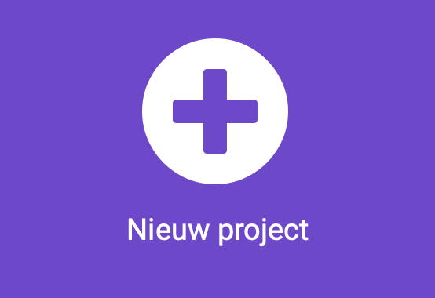
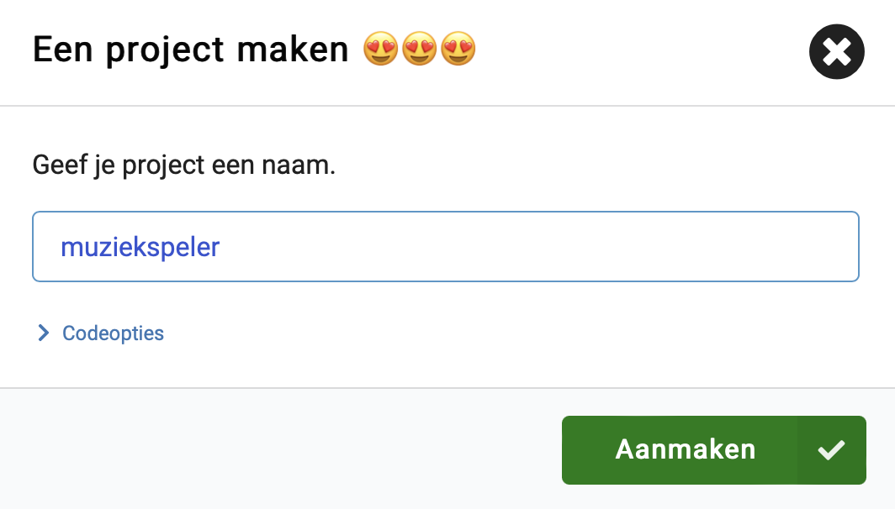
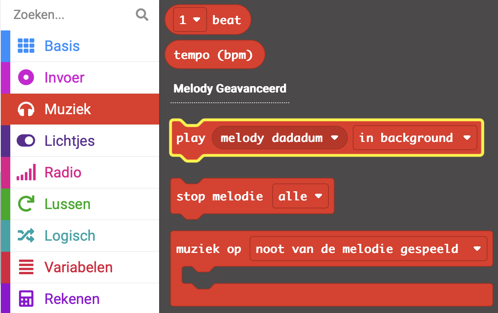
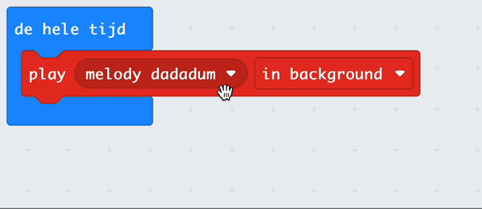
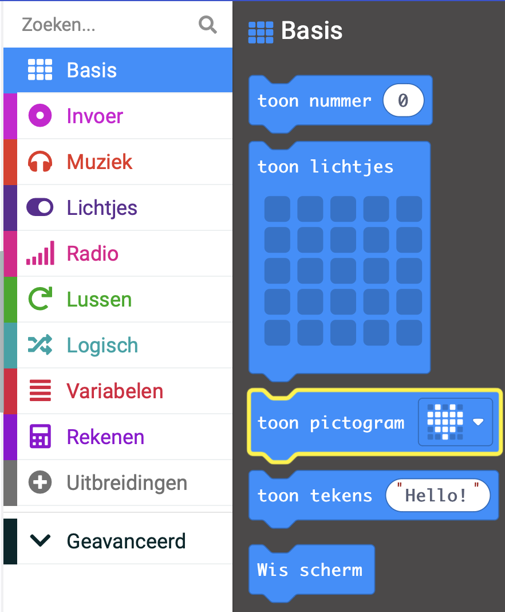
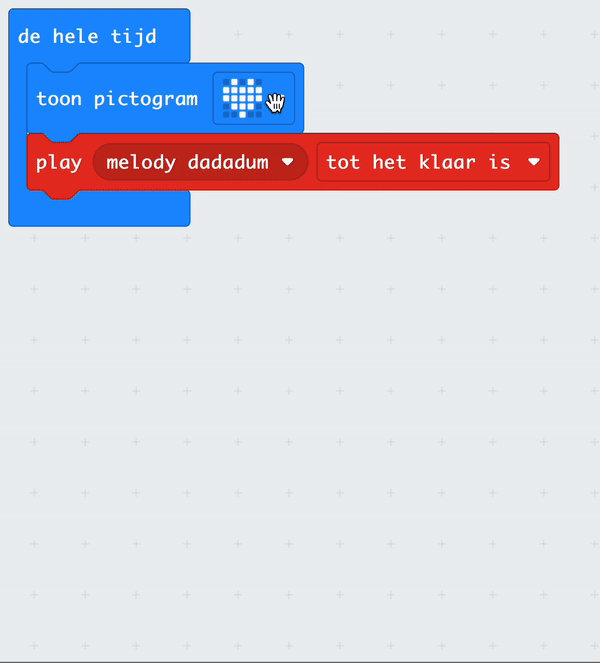

## Speel een deuntje

### MakeCode openen

Om je micro:bit-project te maken, moet je eerst de MakeCode-editor openen.

--- task ---

Open de MakeCode editor in [makecode.microbit.org](https://makecode.microbit.org){:target="_blank"}.

--- collapse ---

---
title: Offline versie van de editor
---

Er is ook een [downloadbare versie van de MakeCode editor](https://makecode.microbit.org/offline-app){:target="_blank"}.

--- /collapse ---

--- /task ---

### Eerste micro:bit-project?

[[[makecode-tour]]]

### Maak je project

Zodra de editor is geopend, moet je een nieuw project aanmaken en je project een naam geven.

--- task ---

Klik op de knop **Nieuw Project**.



--- /task ---

--- task ---

Geef je nieuwe project de naam `muziekspeler` en klik op **Aanmaken**.



**Tip:** Om het makkelijker te maken om je project later terug te vinden, geef het een logische naam die gerelateerd is aan de activiteit die je aan doen bent.

--- /task ---

### Speel melodie


Je gaat het `de hele tijd`{:class="microbitbasic"} blok gebruiken om gebruik te maken van de luidspreker uitvoer op de micro:bit (alleen voor V2 gebruikers).

--- collapse ---
---
title: V1 micro:bit-gebruikers
---

Luidspreker output is alleen beschikbaar op de V2 micro:bit. Je moet externe koptelefoon/speakers aansluiten om geluid af te spelen op de V1. Je kunt het geluid wel afspelen op de simulator.

Er is een [gids voor het aansluiten van koptelefoon/speakers op de V1 micro:bit](https://makecode.microbit.org/projects/hack-your-headphones/make){:target="_blank"}.

--- /collapse ---


--- task ---

Sleep vanuit het menu `Muziek`{:class="microbitmusic"} het blok `play melody dadadum`{:class="microbitmusic"} en plaats het in het blok `de hele tijd`{:class="microbitbasic"}.



--- /task ---

--- task ---

Klik op de pijl omlaag naast `in background` op het `play melody dadadum`{:class='microbitmusic'} blok.

Kies `tot het klaar is`.



--- /task ---

### Geef je liedje meer stijl

Naast het spelen van een melodie kun je ook een foto aan het LED-scherm toevoegen om wat meer stijl toe te voegen!

--- task ---

Open het menu `Basis`{:class="microbitbasic"} en zoek het blok `toon pictogram`{:class="microbitbasic"}.



--- /task ---

--- task ---

Sleep het `toon pictogram`{:class="microbitbasic"} blok in de code editor.

Plaats het in het `de hele tijd`{:class="microbitbasic"} blok **boven** je `play melody`{:class="microbitmusic"} blok.

--- /task ---

--- task ---

MakeCode heeft vooraf geprogrammeerde pictogrammen die worden weergegeven op het LED-scherm.

De standaardinstelling is een **hart**-pictogram.

**Klik** op het hart om de andere opties te zien.

**Kies** een pictogram dat je melodie vertegenwoordigt.



Wij hebben deze kleine eend gekozen!

```microbit
basic.forever(function () {
    basic.showIcon(IconNames.Duck)
    music._playDefaultBackground(music.builtInPlayableMelody(Melodies.Dadadadum), music.PlaybackMode.UntilDone)
})
```

--- /task ---

--- task ---

Als je een wijziging aanbrengt in een codeblok in het bewerkingspaneel zal de simulator opnieuw starten.

**Test je programma**

+ Je zou nu de melodie moeten horen spelen totdat deze klaar is (en dan herhalend vanwege de lus door het de hele tijd blok)
+ Je zou ook het pictogram moeten zien dat je hebt gekozen op de LED's

--- /task ---    

Goed gedaan, je hebt je eerste muziekprogramma op een micro:bit gemaakt!
