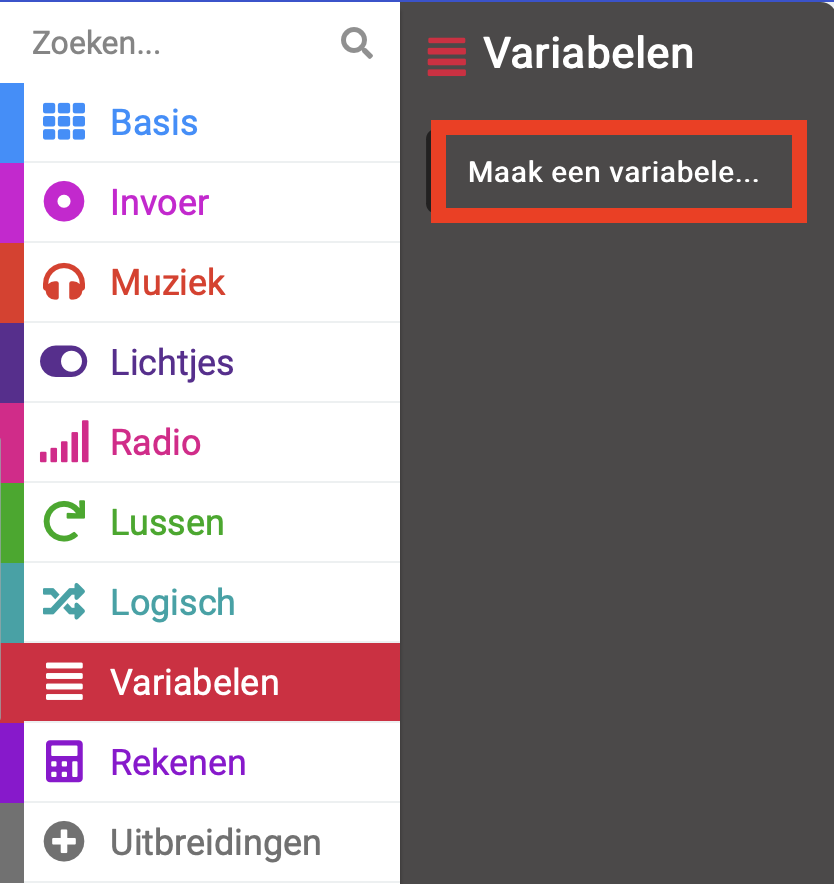
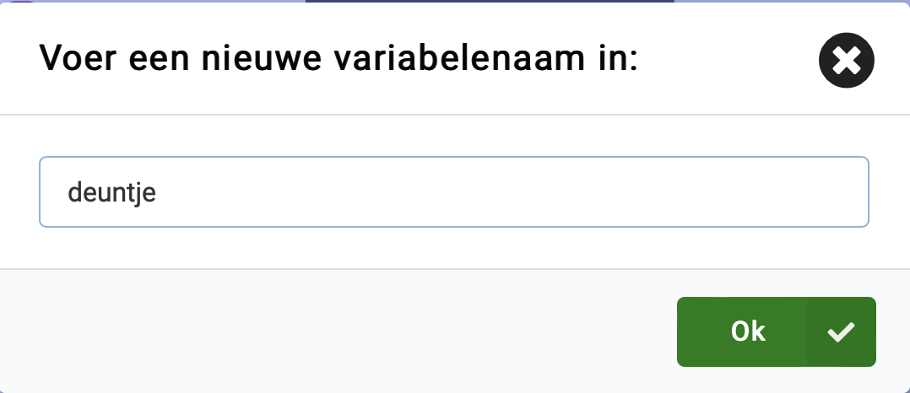
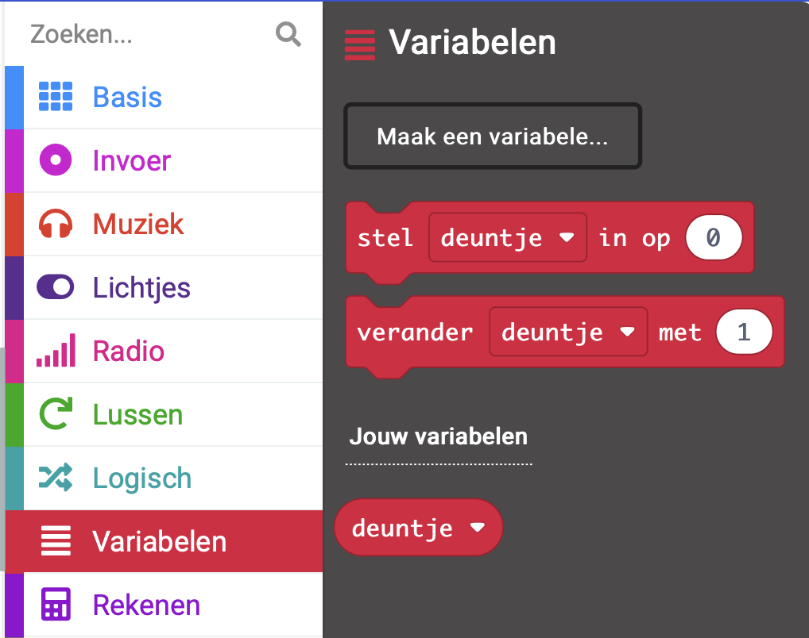
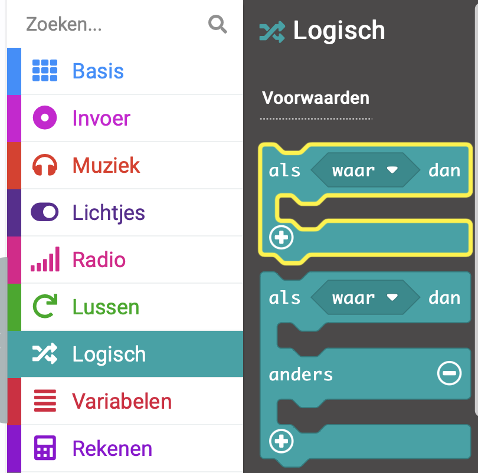
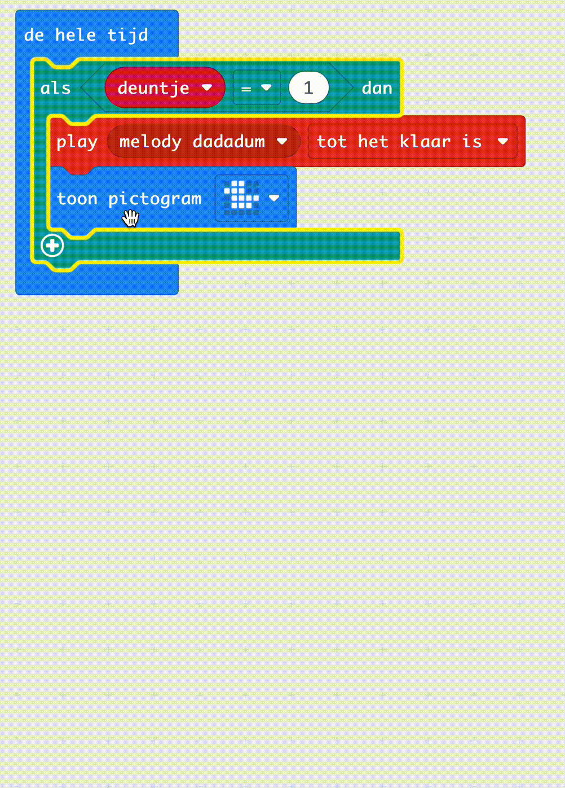
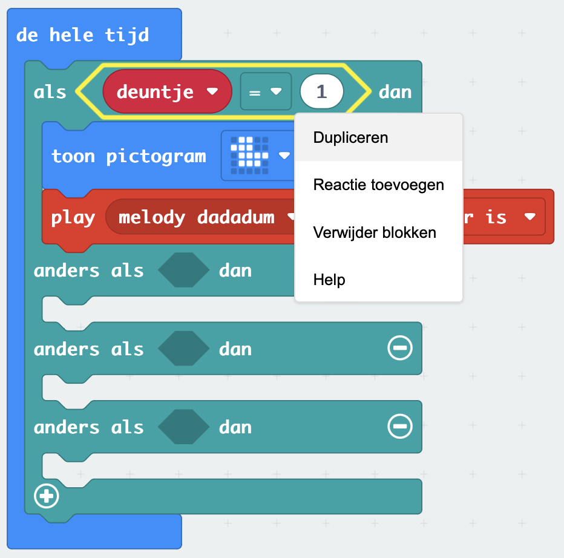
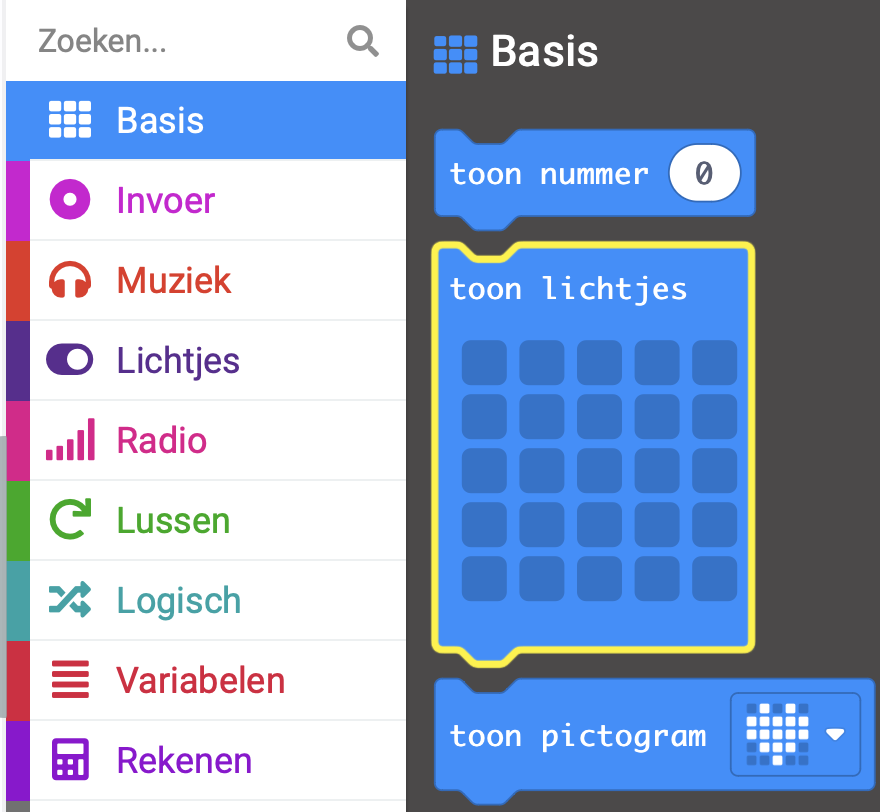
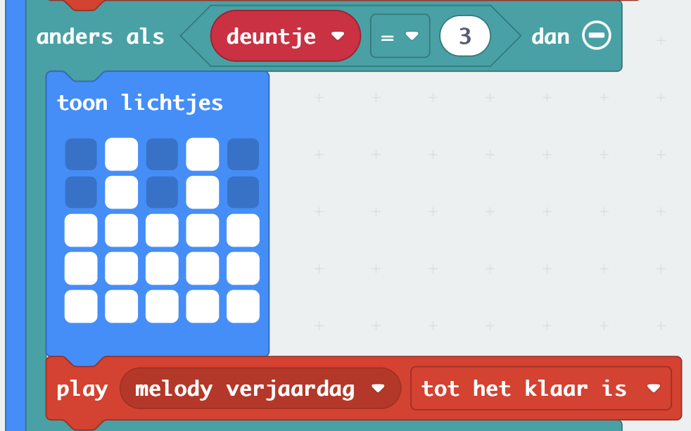

## Keuzes toestaan

### Maak een variabele

Om je muziekspeler te maken moet je variabelen gebruiken.

<p style="border-left: solid; border-width:10px; border-color: #0faeb0; background-color: aliceblue; padding: 10px;">
Wat is een <span style="color: #0faeb0">variabele?</span>

Een variabele is een manier om gegevens in je programma's te labelen en op te slaan. Je programma kan gegevens die zijn opgeslagen in een variabele gebruiken en wijzigen wanneer deze wordt uitgevoerd.

Gegevens die in een variabele zijn opgeslagen, kunnen een getal zijn zoals '10' of een woord zoals 'dinosaurus'.</p>

--- task ---

Open het `Variabelen`{:class="microbitvariables"} menu en klik op **Maak een variabele**.



--- /task ---

--- task ---

Geef de nieuwe variabele de naam `deuntje`{:class="microbitvariables"} en klik dan op de **Ok** knop.



--- /task ---

Er zullen nu nieuwe blokken beschikbaar zijn die je kunt gebruiken om de waarde die is opgeslagen in de variabele `deuntje`{:class="microbitvariables"} in te stellen, te veranderen of te gebruiken.



--- task ---

Sleep het `stel in op`{:class="microbitvariables"} blok naar het bewerkingspaneel en plaats deze in het `bij opstart`{:class="microbitbasic"} blok.

Verander de `0` naar `1`.

```microbit
let tune = 1
```

--- /task ---

### Gebruik van als...dan

Om je muziekspeler verschillende melodie keuzes te kunnen laten spelen, moet je voor elke melodie een logisch blok gebruiken.

--- task ---

Vanuit het `Logisch`{:class="microbitlogic"} menu, kies het `als`{:class="microbitlogic"} blok.



--- /task ---

--- task ---

Plaats het `als`{:class="microbitlogic"} boven het blok `toon pictogram`{:class="microbitbasic"}.

Klik op het `Logisch`{:class="microbitlogic"} menu en sleep een vergelijking `0 = 0`{:class="microbitlogic"} blok.

Plaats dit in het `waar`{:class="microbitlogic"} gebied van het `als`{:class="microbitlogic"} blok.

```microbit
basic.forever(function () {
    if (0 == 0) {

    }
    basic.showIcon(IconNames.Duck)
    music._playDefaultBackground(music.builtInPlayableMelody(Melodies.Dadadadum), music.PlaybackMode.UntilDone)
})
```

--- /task ---

--- task ---

Sleep vanuit het menu `Variabelen`{:class="microbitvariables"} een blok `deuntje`{:class="microbitvariables"}.

Plaats het in de eerste `0` in het `0 = 0`{:class="microbitlogic"} blok.

Verander de tweede `0` in `1`.

```microbit
basic.forever(function () {
    let tune = 0
    if (tune == 1) {

    }
    basic.showIcon(IconNames.Duck)
    music._playDefaultBackground(music.builtInPlayableMelody(Melodies.Dadadadum), music.PlaybackMode.UntilDone)
})
```

--- /task ---

--- task ---

Verplaats de `toon pictogram`{:class="microbitbasic"} en `play melody`{:class="microbitmusic"} blokken zo dat ze in het `als`{:class="microbitlogic"} blok komen te staan.

**Tip:** Wanneer je een blok selecteert, zullen alle blokken eronder ook bewegen, dus sleep gewoon het `toon pictogram`{:class="microbitbasic"} blok en de anderen zullen volgen.

```microbit
basic.forever(function () {
    let tune = 0
    if (tune == 1) {
        basic.showIcon(IconNames.Duck)
        music._playDefaultBackground(music.builtInPlayableMelody(Melodies.Dadadadum), music.PlaybackMode.UntilDone)
    }
})
```

--- /task ---

Om meer melodie keuzes toe te voegen, moet je meer voorwaarden maken in het `als`{:class="microbitlogic"} 
blok.

--- task ---

Klik op het `+` -symbool onderaan links van het `als`{:class="microbitlogic"} -blok. Hierdoor wordt een `anders`{:class="microbitlogic"} sectie aangemaakt.

--- /task ---

--- task ---

Klik op het `+` symbool onder de `anders`{:class="microbitlogic"} sectie.

Hierdoor wordt een `anders als`{:class="microbitlogic"} sectie aangemaakt.

Herhaal dit twee keer, zodat je drie `anders als`{:class="microbitlogic"} en een `anders`{:class="microbitlogic"} sectie hebt.

--- /task ---

--- task ---

Klik op het `-` symbool naast de `anders`{:class="microbitlogic"} om de `anders`{:class="microbitlogic"} sectie te verwijderen.



--- /task ---

--- task ---

Klik met de rechtermuisknop op het blok `deuntje`{:class="microbitvariables"} `=`{:class="microbitlogic"} `1` en dupliceer het.



--- /task ---

--- task ---

Plaats het gedupliceerde `deuntje`{:class="microbitvariables"} `=`{:class="microbitlogic"} `1` blok tussen de eerste `als`{:class="microbitlogic"} en `dan`{:class="microbitlogic"}.

Dupliceer nog twee vergelijkingsblokken en plaats ze tussen de andere `anders als`{:class="microbitlogic"} en `dan`{:class="microbitlogic"} onderdelen.

```microbit
basic.forever(function () {
    let tune = 0
    if (tune == 1) {
        basic.showIcon(IconNames.Duck)
        music._playDefaultBackground(music.builtInPlayableMelody(Melodies.Dadadadum), music.PlaybackMode.UntilDone)
    } else if (tune == 1) {

    } else if (tune == 1) {

    } else if (tune == 1) {

    }
})
```

--- /task ---

--- task ---

Binnen de eerste `anders als`{:class="microbitlogic"} sectie, verander de `1` naar `2`.

Voor de tweede `anders als`{:class="microbitlogic"} sectie, verander de `1` naar `3`.

Voor de derde `anders als`{:class="microbitlogic"} sectie, verander de `1` naar `4`.

```microbit
basic.forever(function () {
    let tune = 0
    if (tune == 1) {
        basic.showIcon(IconNames.Duck)
        music._playDefaultBackground(music.builtInPlayableMelody(Melodies.Dadadadum), music.PlaybackMode.UntilDone)
    } else if (tune == 2) {

    } else if (tune == 3) {

    } else if (tune == 4) {

    }
})
```

--- /task ---

Je moet nu een andere melodie selecteren voor elke `anders als`{:class="microbitlogic"} sectie.

Elke keer dat waarde van de variabele wordt veranderd, wordt er een andere melodie gespeeld.

--- task ---

Dupliceer het `play melody dadadum`{:class="microbitmusic"} blok.

Plaats het gedupliceerde blok in de eerste `anders als`{:class="microbitlogic"} sectie.

Klik op de pijl naast `melody dadadum`{:class="microbitmusic"} om meer opties te zien.

Scroll om alle melodieën te bekijken en er een te kiezen.

Herhaal deze stappen voor de tweede en derde `anders als`{:class="microbitlogic"} secties.

Je zou nu vier melodieën moeten hebben, één voor elk van de vier voorwaarden.

```microbit
basic.forever(function () {
    let tune = 0
    if (tune == 1) {
        music._playDefaultBackground(music.builtInPlayableMelody(Melodies.Dadadadum), music.PlaybackMode.UntilDone)
        basic.showIcon(IconNames.Duck)
    } else if (tune == 2) {
        music._playDefaultBackground(music.builtInPlayableMelody(Melodies.Punchline), music.PlaybackMode.UntilDone)
    } else if (tune == 3) {
        music._playDefaultBackground(music.builtInPlayableMelody(Melodies.Birthday), music.PlaybackMode.UntilDone)
    } else if (tune == 4) {
        music._playDefaultBackground(music.builtInPlayableMelody(Melodies.Baddy), music.PlaybackMode.UntilDone)
    }
})
```

--- /task ---

Je moet ook een ander **pictogram** selecteren voor elk van je nieuwe nummers.

Je kan het `toon pictogram`{:class="microbitbasic"} blok dupliceren.

Je kunt ook het blok `toon lichtjes`{:class="microbitbasic"} gebruiken om je eigen afbeelding te tekenen!

--- collapse ---

---
title: Gebruik het toon lichtjes blok
---

In het `Basis`{:class="microbitbasic"} menu, zoek het blok `toon lichtjes`{:class="microbitbasic"} en sleep het in een `anders als`{:class="microbitlogic"} sectie om het te gebruiken.



Je kunt op elk van de vierkantjes klikken om je afbeelding te tekenen. Witte vierkantjes worden verlicht op de micro:bit.

We hebben een **verjaardagstaart** getekend voor de melodie `verjaardag`.



--- /collapse ---

--- task ---

Voeg pictogrammen toe voor elk van je liedjes met behulp van het `toon pictogram`{:class="microbitbasic"} of `toon lichtjes`{:class="microbitbasic"} blok.

```microbit
basic.forever(function () {
    let tune = 0
    if (tune == 1) {
        basic.showIcon(IconNames.Duck)
        music._playDefaultBackground(music.builtInPlayableMelody(Melodies.Dadadadum), music.PlaybackMode.UntilDone)
    } else if (tune == 2) {
        basic.showIcon(IconNames.Silly)
        music._playDefaultBackground(music.builtInPlayableMelody(Melodies.Punchline), music.PlaybackMode.UntilDone)
    } else if (tune == 3) {
        basic.showLeds(`
            . # . # .
            . # . # .
            # # # # #
            # # # # #
            # # # # #
            `)
        music._playDefaultBackground(music.builtInPlayableMelody(Melodies.Birthday), music.PlaybackMode.UntilDone)
    } else if (tune == 4) {
        basic.showIcon(IconNames.Skull)
        music._playDefaultBackground(music.builtInPlayableMelody(Melodies.Baddy), music.PlaybackMode.UntilDone)
    }
})
```

--- /task ---

--- task ---

**Foutopsporing:** Zorg ervoor dat je alle getallen in de vergelijkingen hebt gewijzigd nadat ze zijn gedupliceerd.

Je zou `1` moeten hebben in de `als`{:class="microbitlogic"} sectie en vervolgens `2, 3, 4` in de `anders als`{:class="microbitlogic"} secties.

--- /task ---

--- task ---

Als je een wijziging aanbrengt in een codeblok in het bewerkingspaneel zal de simulator opnieuw starten.

**Test je programma**

+ Verander de waarde van het `stel deuntje in op`{:class="microbitvariables"} blok van `1` in `2` in het `bij opstarten`{:class="microbitbasic"} blok. De simulator zal opnieuw opstarten en de melodie afspelen voor 2 en het bijbehorende pictogram tonen.

+ Herhaal dezelfde stappen voor melodieën 3 en 4.

+ Zorg ervoor dat je de waarde van de `stel deuntje in op`{:class="microbitvariables"} variabele terug verandert naar `1` aan het einde van je tests.

Goed gedaan, je hebt verschillende melodieën gekozen voor je muziekspeler!

--- /task ---
