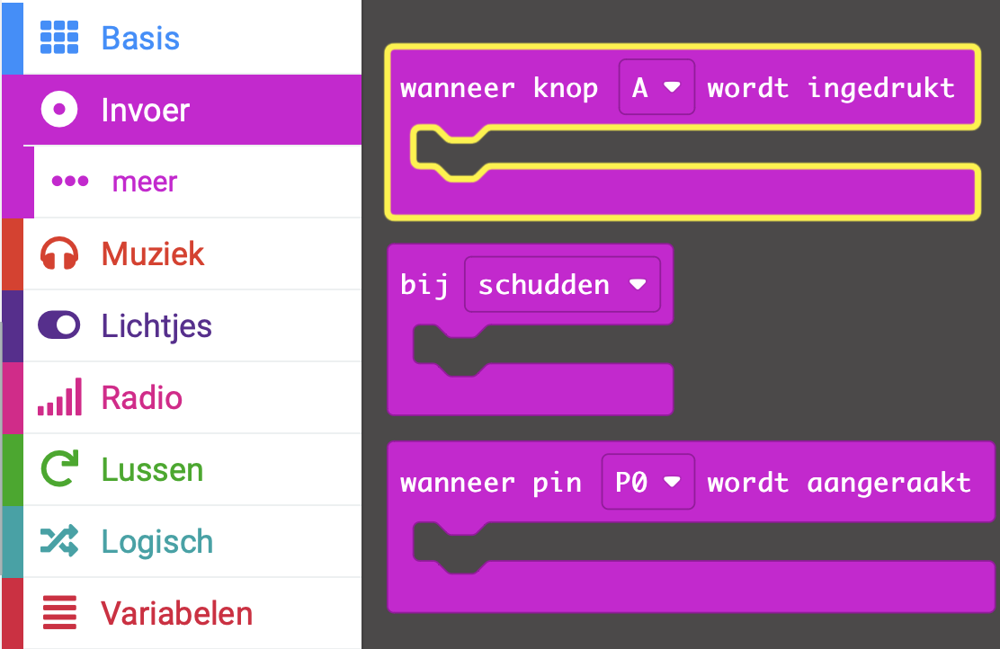
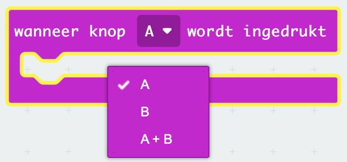
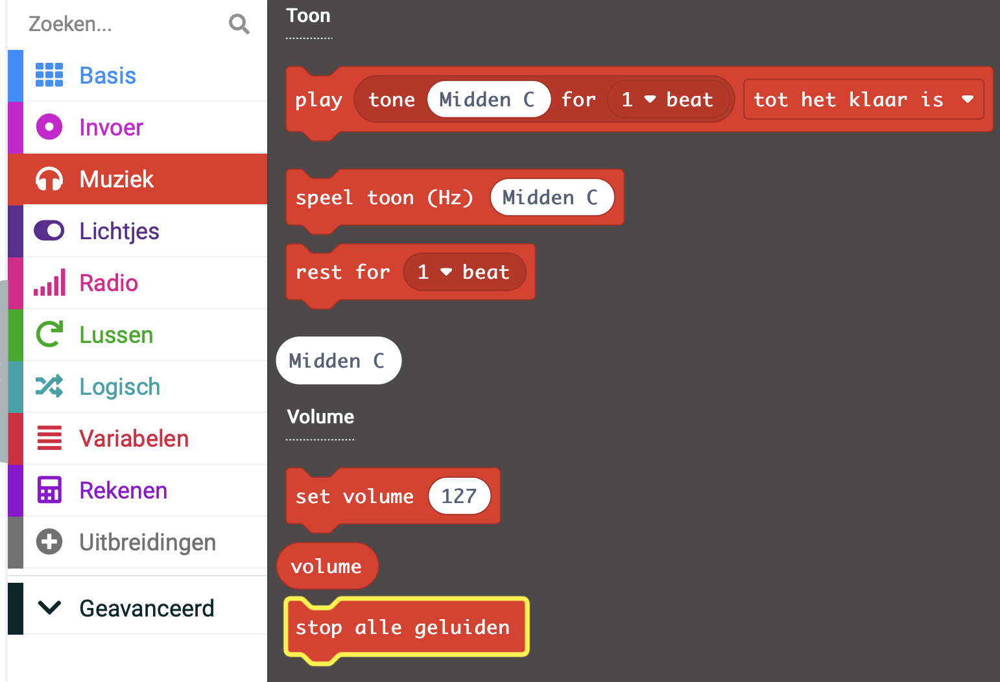
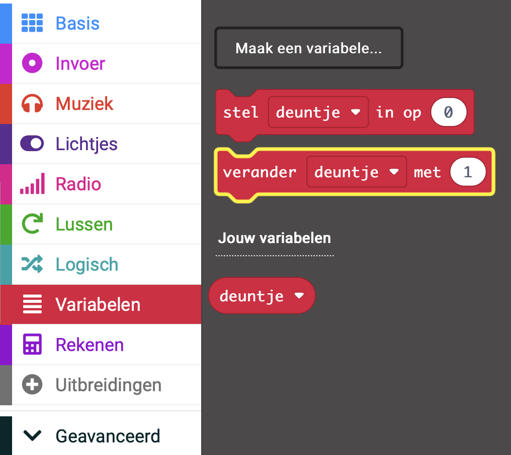

## Gebruik de knoppen om de deuntjes over te slaan

In plaats van de melodie te veranderen door de `deuntje` variabele waarde in de `bij opstarten` blok te veranderen, kun je knoppen gebruiken om de waarde te veranderen (en dus de melodie).

In deze stap maak je code om nummers over te slaan met behulp van micro:bit's event handlers.

<p style="border-left: solid; border-width:10px; border-color: #0faeb0; background-color: aliceblue; padding: 10px;">
Wat is een <span style="color: #0faeb0">event handler</span>?

Een event-handler is code die wordt uitgevoerd wanneer een bepaalde gebeurtenis plaatsvindt, zoals "knop A ingedrukt".

</p>

### Bediening van knoppen toevoegen

De micro:bit heeft een knop `A` en een knop `B`.

Je kunt een event gebruiken om te bepalen wat er gebeurt als er op een knop wordt gedrukt.

### Ga naar het volgende nummer

Knop B zit rechts op de micro:bit, we gebruiken dus deze knop om naar het volgende nummer te gaan.

Om dit te doen, moet je de waarde van de `deuntje`{:class="microbitvariables"} variabele wijzigen met `1`.

--- task ---

Vanuit het `Invoer`{:class="microbitinput"} menu, sleep je het `wanneer knop wordt ingedrukt`{:class="microbitinput"} blok naar het bewerkingspaneel.



--- /task ---

--- task ---

Klik op het pijltje naast `A`{:class="microbitinput"} op het `wanneer knop wordt ingedrukt`{:class="microbitinput"} blok.

Verander de `A`{:class="microbitinput"} in een `B`{:class="microbitinput"}



--- /task ---

#### Stop alle geluiden!

Nu moet je het huidige deuntje stoppen.

--- task ---

Sleep vanuit het menu `Muziek`{:class="microbitmusic"} het blok `stop alle geluiden`{:class="microbitmusic"}.

Plaats het in het `wanneer knop [B] wordt ingedrukt`{:class="microbitinput"} blok in het bewerkingspaneel.



```microbit
input.onButtonPressed(Button.B, function () {
    music.stopAllSounds()
})
```

--- /task ---

--- task ---

Sleep vanuit het menu `Variabelen`{:class="microbitvariables"} een blok `verander met`{:class="microbitvariables"}.

Plaats het onder het blok `stop alle geluiden`{:class="microbitmusic"}.



```microbit
let tune = 0
input.onButtonPressed(Button.B, function () {
    music.stopAllSounds()
    tune += 1
})
```

--- /task ---

#### Omgaan met 'buiten bereik'

Als de waarde van de variabele `4` is, zal het wijzigen ervan met `1` de waarde `5` maken.

🚨 Maar er is geen melodie gekoppeld aan de waarde `5`! 🚨

Omdat je maar vier melodieën hebt, moet je, als de variabele naar 5 verandert, teruggaan naar de eerste melodie.

```microbit
basic.forever(function () {
    let tune = 0
    if (tune == 1) {
        basic.showIcon(IconNames.Duck)
        music._playDefaultBackground(music.builtInPlayableMelody(Melodies.Dadadadum), music.PlaybackMode.UntilDone)
    } else if (tune == 2) {
        basic.showIcon(IconNames.Silly)
        music._playDefaultBackground(music.builtInPlayableMelody(Melodies.Punchline), music.PlaybackMode.UntilDone)
    } else if (tune == 3) {
        basic.showLeds(`
            . # . # .
            . # . # .
            # # # # #
            # # # # #
            # # # # #
            `)
        music._playDefaultBackground(music.builtInPlayableMelody(Melodies.Birthday), music.PlaybackMode.UntilDone)
    } else if (tune == 4) {
        basic.showIcon(IconNames.Skull)
        music._playDefaultBackground(music.builtInPlayableMelody(Melodies.Baddy), music.PlaybackMode.UntilDone)
    }
})
```

--- task ---

Vanuit het `Logisch`{:class="microbitlogic"} menu, sleep het `als`{:class="microbitlogic"} blok.

Plaats het onder het `verander deuntje met`{:class="microbitvariables"} blok in je code.

```microbit
let tune = 0
input.onButtonPressed(Button.B, function () {
    music.stopAllSounds()
    tune += 1
    if (true) {

    }
})
```

--- /task ---

--- task ---

Sleep ook vanuit het menu `Logisch`{:class="microbitlogic"} een blok `0 < 0`{:class="microbitlogic"}.

Plaats dit in het `waar` deel van het `als`{:class="microbitlogic"} blok.

Verander de `<` (kleiner dan) in `>` (groter dan) door op de pijl naast het `<` -symbool te klikken.

```microbit
let tune = 0
input.onButtonPressed(Button.B, function () {
    music.stopAllSounds()
    tune += 1
    if (0 > 0) {

    }
})
```

--- /task ---

--- task ---

Sleep vanuit het menu `Variabelen`{:class="microbitvariables"} een blok `deuntje`{:class="microbitvariables"}.

Plaats het in de eerste `0` in het `0 > 0`{:class="microbitlogic"} blok.

```microbit
let tune = 0
input.onButtonPressed(Button.B, function () {
    music.stopAllSounds()
    tune += 1
    if (tune > 0) {

    }
})
```

Verander de tweede `0` in `4`.

```microbit
let tune = 0
input.onButtonPressed(Button.B, function () {
    music.stopAllSounds()
    tune += 1
    if (tune > 4) {

    }
})
```

--- /task ---

--- task ---

Sleep vanuit het menu `Variabelen`{:class="microbitvariables"} een blok `stel in op`{:class="microbitvariables"}.

Plaats het in het `als`{:class="microbitlogic"} blok in je code.

Verander de `0` naar `1`.

```microbit
let tune = 0
input.onButtonPressed(Button.B, function () {
    music.stopAllSounds()
    tune += 1
    if (tune > 4) {
        tune = 1
    }
})
```

--- /task ---


#### Ga naar het vorige nummer

Knop A zit links op de micro:bit, we gebruiken dus deze knop om naar het vorige nummer te gaan.

Om dit te doen, moet je de waarde van de `deuntje`{:class="microbitvariables"} variabele wijzigen met `-1`.

Je kunt de code die je hebt gemaakt om te bepalen wat er gebeurt wanneer knop B wordt ingedrukt opnieuw gebruiken.

--- task ---

**Klik met de rechtermuisknop** op het bovenste deel van het `wanneer knop B wordt ingedrukt`{:class="microbitinput"} blok dat je nu hebt in het bewerkingspaneel.

Klik op **Dupliceren** om een kopie van het hele blok te maken.

Je zou nu een tweede `wanneer knop wordt ingedrukt`{:class="microbitinput"} blok moeten hebben dat 'grijs' wordt weergegeven.

Wijzig de knop van `B` naar `A`. Hierdoor wordt voorkomen dat het blok grijs wordt weergegeven.

```microbit
let tune = 0
input.onButtonPressed(Button.A, function () {
    music.stopAllSounds()
    tune += 1
    if (tune > 4) {
        tune = 1
    }
})
input.onButtonPressed(Button.B, function () {
    music.stopAllSounds()
    tune += 1
    if (tune > 4) {
        tune = 1
    }
})
```

--- /task ---

--- task --- Breng deze wijzigingen aan in het blok `wanneer knop A wordt ingedrukt`{:class="microbitinput"}:

Verander de `1` in `-1` in het `verander`{:class="microbitvariables"} blok.

In het vergelijkingsblok:

+ Verander de `>` naar `<`

+ Verander de `4` naar `1`

Wijzig de `1` in `4` in het `stel in op`{:class="microbitvariables"} blok.

--- /task ---


Je zou nu een `wanneer knop A wordt ingedrukt`{:class="microbitinput"} codeblok moeten hebben en een `wanneer knop B wordt ingedrukt`{:class="microbitinput"} codeblok:

```microbit
let tune = 0
input.onButtonPressed(Button.A, function () {
    music.stopAllSounds()
    tune += -1
    if (tune < 1) {
        tune = 4
    }
})
input.onButtonPressed(Button.B, function () {
    music.stopAllSounds()
    tune += 1
    if (tune > 4) {
        tune = 1
    }
})
```

--- task ---

**Foutopsporing:** Zorg ervoor dat je de juiste waarden hebt gewijzigd in de blokken die worden gebruikt om de waarde van de variabelen te veranderen.

Bijvoorbeeld: `Knop A` zou de variabele moeten veranderen met `-1` en Knop B zou de waarde van de variabele moeten veranderen met `1`.

--- /task ---

--- task ---

Als je een wijziging aanbrengt in een codeblok in het bewerkingspaneel zal de simulator opnieuw starten.

**Test je programma**

+ Druk op knop A om naar het vorige nummer te gaan

+ Druk op knop B om naar het volgende nummer te gaan

--- /task ---


Goed gedaan, je kunt nu nummers overslaan en naar de volgende of vorige nummers gaan!
